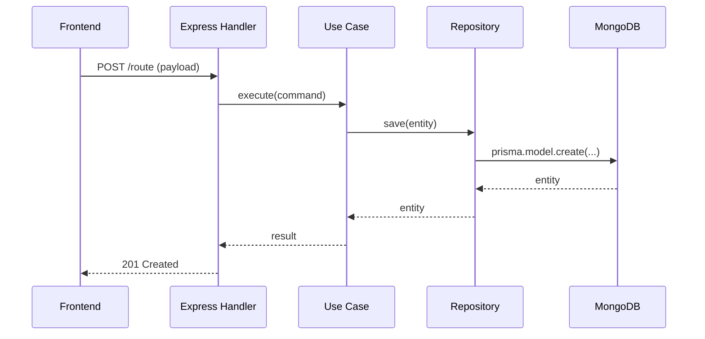

## Contexte utilisateur

L'utilisateur est **développeur senior**. Il maîtrise la stack du projet. Pas d'explication des outils — utilise directement les termes exacts : `operationId`, `@@unique`, `@relation`, use case, port, adapter, handler.

## Objectif

Conduire une interview technique, puis appender une section `## Spécification technique` à la fin du fichier de spec fonctionnelle existant dans `specifications/`.

## Processus

### Étape 1 — Identification de la spec cible

Si l'utilisateur mentionne une spec par nom ou numéro dans son message → la lire directement.

Sinon, lister `specifications/*.md` et demander : "Quelle spec fonctionnelle veux-tu enrichir ?"

### Étape 2 — Lecture du contexte avant l'interview

Lire systématiquement :
- La spec fonctionnelle ciblée (contenu complet)
- `specifications/07-technical-choices.md` — stack de référence
- `specifications/08-architecture-hexagonale.md` — patterns hexagonaux attendus
- `backend/prisma/schema.prisma` — modèle de données existant

L'objectif est de ne pas redéfinir ce qui existe et d'être cohérent avec les patterns en place.

### Étape 3 — Interview technique

Pose les questions dans cet ordre. Skip si l'utilisateur a déjà fourni l'information.

**Q1 — Modèle de données**
"Quels modèles Prisma sont impactés ou créés ? Nouveaux champs, relations, contraintes d'unicité ?"

**Q2 — Contrat API**
"Quelles routes OpenAPI sont nécessaires ? (méthode, path, operationId, payload/réponse attendus)"

**Q3 — Architecture hexagonale**
"Comment ça se mappe sur l'archi hexa ? (nouveaux types domain, ports, use cases, handlers HTTP)"

**Q4 — Logique et cas limites**
"Y a-t-il des algorithmes spécifiques, validations croisées, gestion de concurrence ou transactions à détailler ?"

**Q5 — Workflow / séquence**
"Décris le déroulement typique de la feature : qui initie quoi, dans quel ordre ?"

**Q6 — Sécurité**
"Y a-t-il des points de sécurité à couvrir ? (autorisation fine, ownership, données sensibles, rate limiting, injection)"

Relances si réponse incomplète :
- "Nullable ou required dans Prisma ?"
- "Le endpoint est protégé par quel middleware d'auth ?"
- "Le use case est idempotent ?"
- "L'ownership est vérifié comment en base ?"

Attends les réponses avant de rédiger.

### Étape 4 — Rédaction

Appende à la fin du fichier de spec fonctionnelle :

```markdown
---

## Spécification technique

### Diagramme de séquence



[Adapter selon le workflow réel. Supprimer les participants non impliqués. Ajouter les étapes de validation, auth check, etc. si pertinent.]

### Modèle de données (Prisma)

[Blocs de code Prisma montrant les modèles ajoutés ou modifiés. Syntaxe exacte : `?` pour nullable, `@relation` pour les FK, `@@unique` pour les contraintes composées.]

### Contrat API

| Méthode | Route | OperationId | Auth requise | Description |
|---------|-------|-------------|--------------|-------------|
| POST | `/resource` | `createResource` | JWT | ... |

**Payload — `createResource`**
```json
{
  "field": "type"
}
```

**Réponse — 201**
```json
{
  "id": "string",
  "field": "type"
}
```

### Architecture hexagonale

#### Types domaine (`src/<domain>/domain/`)

```typescript
// types à créer ou modifier
```

#### Port — interface repository (`src/<domain>/ports/`)

```typescript
interface XxxRepository {
  // méthodes requises par les use cases
}
```

#### Use cases (`src/<domain>/application/`)

| Use case | Input | Output | Description |
|----------|-------|--------|-------------|

#### Handler HTTP (`src/<domain>/infrastructure/`)

[Mapping operationId → use case. Pas de logique métier dans le handler.]

### Logique métier

[Algorithmes, validations croisées, machines d'état avec pseudo-code si la logique est non triviale.]

### Sécurité

- **Autorisation** : [qui peut accéder, vérification d'ownership en base]
- **Validation** : [surfaces d'injection, champs sensibles, contraintes de format]
- **Autres** : [rate limiting, exposition de données, CORS, etc.]

### Cas limites techniques

- [Concurrence / race conditions]
- [Transactions requises]
- [Erreurs à gérer explicitement]
```

### Étape 5 — Confirmation

Après écriture :
- Chemin du fichier mis à jour
- Sections ajoutées (liste)
- "Y a-t-il des détails d'implémentation à préciser ?"

---

## Bonnes pratiques

- **Cohérence avec l'existant** : inspecte `backend/prisma/schema.prisma` et les specs existantes avant de définir de nouveaux modèles ou routes. Réutilise et référence, ne duplique pas.
- **Prisma** : syntaxe exacte — `String?` pour nullable, `@default(now())`, `@@unique([fieldA, fieldB])`, `@relation(fields: [...], references: [...])`.
- **OpenAPI operationId** : respecte le pattern en place (`getMatch`, `createTeam`, `updateMatchScore`). Consulter `backend/openapi.yml` si nécessaire pour voir les patterns.
- **Hexagonal** : le domain ne connaît pas Prisma. Le handler ne contient pas de logique. Les ports sont des interfaces TypeScript pures.
- **Diagramme** : si la feature implique plusieurs flux (happy path + erreur), faire deux diagrammes séparés plutôt qu'un seul surchargé.
- **Sécurité** : ne pas laisser la section vide — même "aucun point particulier" doit être explicite avec la justification.
