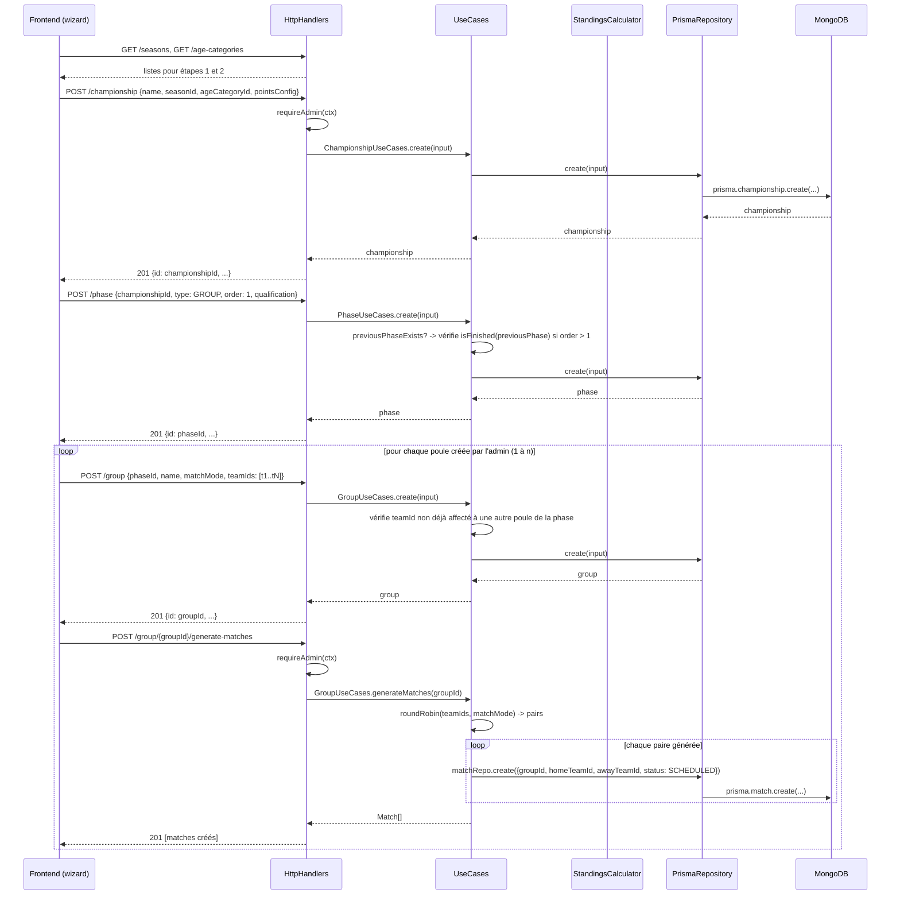

# Championnat

## Définition

Un championnat est une compétition rattachée à une **catégorie d'âge** et à une **saison** (entité dédiée, voir [[22-season]]). Il est composé d'une suite ordonnée de **phases** qui se déroulent séquentiellement.

---

## Catégories d'âge

| Code   | Description     |
| ------ | --------------- |
| U9     | Moins de 9 ans  |
| U11    | Moins de 11 ans |
| U13    | Moins de 13 ans |
| U15    | Moins de 15 ans |
| U18    | Moins de 18 ans |
| Senior | Seniors         |

---

## Configuration des points (PointsConfig)

Chaque championnat définit sa propre table de points appliquée lors du calcul des classements.

| Situation | Exemple de valeur | Description                                       |
| --------- | ----------------- | ------------------------------------------------- |
| Victoire  | 3                 | Points attribués à l'équipe gagnante              |
| Match nul | 2                 | Points attribués à chaque équipe en cas d'égalité |
| Défaite   | 1                 | Points attribués à l'équipe perdante              |
| Forfait   | 0                 | Points attribués à l'équipe déclarant forfait     |

> La configuration est libre : l'organisateur peut choisir n'importe quelle valeur pour chaque situation.
> La règle classique (3/1/0) reste possible, tout comme des systèmes alternatifs (3/2/1/0, etc.).

---

## Phases d'un championnat

### Phase unique (cas simple)

Un championnat peut ne contenir qu'une seule phase de type `GROUP` avec une poule unique en **aller-retour**.

```text
Championnat
└── Phase 1 — GROUP
        └── Poule unique (aller-retour)
```

### Championnat multi-phases (cas avancé)

Un championnat peut enchaîner plusieurs phases, chacune conditionnée par les résultats de la précédente.

```text
Championnat
├── Phase 1 — GROUP       (poules, matchs à aller simple ou aller-retour)
│       └── PhaseQualification → définit qui passe en Phase 2
├── Phase 2 — KNOCKOUT    (éliminatoires : 1/4, 1/2, finale)
│       └── PhaseQualification → définit qui passe en Phase 3 (si applicable)
└── Phase 3 — GROUP/KNOCKOUT (optionnel)
```

---

## Types de phases

### GROUP (poule)

- Les équipes sont réparties dans une ou plusieurs poules.
- Chaque équipe rencontre toutes les autres équipes de sa poule.
- Mode de rencontre : `SINGLE` (aller simple) ou `HOME_AND_AWAY` (aller-retour).
- Un classement est généré par poule en fin de phase.

### KNOCKOUT (éliminatoires)

- Les équipes sont appariées deux à deux.
- L'équipe perdante est éliminée.
- Formats possibles : 1/4 de finale, 1/2 de finale, finale, ou séquence personnalisée.
- Des matchs de classement (3ème, 4eme, 5eme place, etc.) peuvent être ajoutés optionnellement.
- Le nombre d'équipes n'est **pas contraint** à une puissance de 2 : les équipes en surnombre au premier tour reçoivent un **bye** (qualification directe au tour suivant) attribué automatiquement par le système.

---

## Règles de qualification inter-phases (PhaseQualification)

Définit comment les équipes issues d'une phase `GROUP` sont sélectionnées pour la phase suivante.

### Critères de sélection

1. **Par rang dans la poule** : ex. tous les 1ers de chaque poule qualifiés automatiquement.
2. **Meilleurs classés parmi un rang** : ex. les 2 meilleurs 2èmes (classement comparatif entre poules).
3. **Combinaison** : ex. tous les 1ers + les 2 meilleurs 2èmes.

### Règles de départage inter-poules (pour les meilleurs N du même rang)

Quand plusieurs équipes du même rang (ex. 2èmes de poule différentes) sont comparées entre elles :

1. Points totaux (selon `PointsConfig`)
2. Différence de buts
3. Nombre de buts marqués
4. En cas d'égalité parfaite : tirage au sort (décision manuelle)

> Le départage inter-poules n'utilise que les matchs joués contre les équipes qui ont participé au même nombre de matchs dans leur poule respective, afin d'assurer une comparaison équitable.

---

## Structure d'un championnat

| Attribut        | Type         | Obligatoire | Description                                              |
| --------------- | ------------ | ----------- | -------------------------------------------------------- |
| `name`          | string       | ✅          | Nom du championnat (ex. "Championnat U13 2026")          |
| `ageCategoryId` | ObjectId     | ✅          | Référence catégorie d'âge (FK, voir [[19-age-category]]) |
| `seasonId`      | ObjectId     | ✅          | Référence saison (FK, voir [[22-season]])                |
| `startDate`     | Date \| null | ❌          | Date de début (optionnelle)                              |
| `endDate`       | Date \| null | ❌          | Date de fin (optionnelle)                                |
| `pointsConfig`  | PointsConfig | ✅          | Configuration des points                                 |

---

## Création d'un championnat (parcours admin)

La création est réservée à l'Admin (voir matrice de permissions [[06-user-profiles]]) et suit un parcours guidé en étapes séquentielles.

### Étape 1 — Sélection de la saison

Liste des saisons actives (non archivées), voir [[22-season]].

### Étape 2 — Sélection de la catégorie d'âge

Liste des catégories d'âge actives, voir [[19-age-category]].

### Étape 3 — Nom du championnat

Champ texte obligatoire.

### Étape 4 — Première phase

L'admin configure la première phase : type (`GROUP` ou `KNOCKOUT`), puis passe à la sélection des équipes (étape 4b). Un championnat doit avoir au moins une phase pour être créé.

### Étape 4b — Sélection des équipes participantes (première phase uniquement)

Les équipes proposées sont filtrées par `ageCategoryId` du championnat (étape 2). L'écran affiché dépend du type de phase choisi :

#### Cas `GROUP`

1. Création d'une ou plusieurs poules : l'admin nomme chaque poule et choisit son mode de rencontre (`SINGLE` ou `HOME_AND_AWAY`). Au moins une poule est requise.
2. Pour chaque poule : sélection des équipes qui la composent (au moins 2). Une équipe ne peut appartenir qu'à une seule poule de la phase — une fois affectée, elle disparaît du pool disponible pour les autres poules.
3. Bouton « Générer les oppositions » (par poule) → crée automatiquement les matchs de la poule selon son mode `SINGLE` (aller simple) ou `HOME_AND_AWAY` (aller-retour).
4. Bloc de configuration des points (`PointsConfig`) — voir section dédiée plus haut. Commun à la phase, pas par poule.
5. Position maximale qualifiante : rang jusqu'auquel une équipe accède à la phase suivante (définit la `PhaseQualification` par rang, voir section dédiée). Commune à la phase, appliquée à chaque poule.

#### Cas `KNOCKOUT`

1. Sélection des équipes par opposition : un tableau de rencontres (bracket) avec deux emplacements « équipe » par confrontation.
2. Seul le vainqueur de chaque confrontation avance au tour suivant (voir contrainte de bye ci-dessus si nombre d'équipes impair/non-puissance-de-2).

### Phases suivantes (N > 1)

- Une nouvelle phase ne peut être créée que lorsque la phase précédente est **terminée** — classement final atteint pour une phase `GROUP` (voir [[05-standings]]), vainqueurs de toutes les confrontations déterminés pour une phase `KNOCKOUT`.
- Le pool d'équipes sélectionnables pour la phase N+1 n'est plus filtré par `ageCategoryId` : il est restreint aux équipes **qualifiées** par la `PhaseQualification` de la phase N.
- Si la phase N+1 est de type `KNOCKOUT`, le système propose un appariement automatique (seeding) basé sur le classement de la phase précédente (ex. 1er de poule vs dernier qualifié). L'admin peut ensuite réajuster manuellement l'appariement avant de valider et générer les matchs.

### Modification et suppression

- Tant qu'**aucun score** n'a été saisi sur un match de la phase courante, l'admin peut régénérer les oppositions/le bracket et modifier la configuration de la phase (`PointsConfig`, mode aller-retour, qualification, appariement).
- Dès qu'un score est saisi sur un match de la phase, sa configuration est **verrouillée** : plus de régénération ni de modification de `PointsConfig`/qualification/appariement.
- Un championnat ou une phase reste supprimable tant qu'aucun score n'est saisi sur un match de la phase courante. Passé ce point, la suppression est bloquée (protection de l'historique).

### Annulation en cours de création (bouton Annuler)

Le parcours de création crée des enregistrements réels en base **avant** la
dernière étape : le `Championship` est créé en quittant l'étape 3 (Nom), la `Phase`
en quittant l'étape 4 (Type de phase). Les poules/brackets et leurs matchs, eux, ne
sont créés qu'en une seule fois, à la toute dernière étape (validation finale du
wizard). Un championnat interrompu avant cette dernière étape reste donc en base
sans poule ni bracket.

- Un bouton **Annuler** est visible à toutes les étapes du wizard (1 à 4c).
- Si aucun `Championship` n'existe encore en base (annulation avant la fin de
  l'étape 3), Annuler quitte directement le wizard sans confirmation — rien n'a
  encore été persisté.
- Dès qu'un `Championship` existe, Annuler ouvre une modale de confirmation à 3
  choix :
  1. **Continuer l'édition** — ferme la modale, reste sur le wizard.
  2. **Supprimer définitivement** — supprime le championnat (`DELETE
/championship/{id}`). Pour un brouillon, la suppression est toujours un
     hard-delete propre : sans poule/bracket, il ne peut y avoir aucun match ni
     score saisi (voir « Modification et suppression » ci-dessus).
  3. **Garder et reprendre plus tard** — ferme le wizard sans rien supprimer ; le
     championnat reste en base à l'état brouillon.
- Un championnat est **brouillon** (`isDraft`) tant que sa phase n'a ni poule ni
  bracket — c'est-à-dire tant que la dernière étape du wizard n'a pas été validée.
  Ce champ `isDraft` est exposé par l'API championnat (`GET /championship`, `GET
/championship/{id}`).
- La liste admin des championnats affiche une action **Reprendre** uniquement sur
  les lignes `isDraft`. Elle rouvre le wizard préempli (saison, catégorie, nom, et
  type de phase si déjà choisi) à la première étape non complétée : étape "Type de
  phase" si aucune phase n'existe encore, étape "Sélection des équipes" si la
  phase existe déjà. La sélection d'équipes et la configuration (étapes 4b/4c)
  n'étant jamais persistées avant la validation finale, elles sont toujours
  ressaisies à la reprise.

---

## Liste des championnats (Admin)

La liste admin (`GET /championship`) affiche un tableau avec les colonnes suivantes :

| Colonne                | Source                           | Description                                                                                                                                                                           |
| ---------------------- | -------------------------------- | ------------------------------------------------------------------------------------------------------------------------------------------------------------------------------------- |
| Nom                    | `name`                           | —                                                                                                                                                                                     |
| Saison                 | `seasonId` (résolu)              | —                                                                                                                                                                                     |
| Catégorie              | `ageCategoryId` (résolu)         | —                                                                                                                                                                                     |
| État                   | `isDraft` / `isFinished`         | Puce colorée + tooltip au survol donnant le libellé. 3 valeurs : **brouillon** (gris, `isDraft`), **en cours** (bleu, ni `isDraft` ni `isFinished`), **terminé** (vert, `isFinished`) |
| Dates                  | `startDate` / `endDate`          | `startDate` – `endDate`, tiret si absentes                                                                                                                                            |
| Type de phase courante | `currentPhaseType`               | Dernière phase par `order` : « Poules » (`GROUP`) ou « Élimination directe » (`KNOCKOUT`) ; tiret si aucune phase (brouillon avant étape 4)                                           |
| Équipes engagées       | `teamsCount`                     | Nombre d'équipes uniques affectées à la phase courante (poules ou bracket) ; `0` tant qu'aucune affectation                                                                           |
| Progression matchs     | `matchesPlayed` / `matchesTotal` | « X/Y » — matchs au statut différent de `SCHEDULED` sur le total généré pour la phase courante ; tiret si aucun match généré                                                          |
| Actions                | —                                | **Reprendre** — visible uniquement si `isDraft` (voir « Annulation en cours de création »)                                                                                            |

`isFinished`, `currentPhaseType`, `teamsCount`, `matchesPlayed` et `matchesTotal` sont calculés côté backend (même approche que `isDraft` : dérivés à la volée depuis phase/poule/bracket/match courants, non stockés) et exposés par `GET /championship` et `GET /championship/{id}`.

---

## Contraintes métier

- Le nom d'un championnat est obligatoire.
- Un championnat doit avoir au moins une phase.
- L'ordre d'une phase est unique au sein d'un championnat — deux phases ne peuvent pas avoir le même `order`.
- Une phase doit avoir au moins une poule ou un tableau éliminatoire ; une phase `GROUP` peut en avoir plusieurs (1 à n).
- Une poule doit avoir au moins 2 équipes.
- Une équipe ne peut être affectée qu'à une seule poule au sein d'une même phase — vérifié applicativement à la création/modification de poule (pas de contrainte DB croisée entre poules).
- Une nouvelle phase ne peut pas être **créée** tant que la phase précédente n'est pas terminée (voir « Phases suivantes » ci-dessus) — a fortiori ses matchs ne peuvent pas débuter avant.
- La qualification inter-phases ne peut être calculée qu'une fois la phase source complète.
- Les équipes sélectionnables pour la phase 1 sont filtrées par `ageCategoryId` du championnat ; pour les phases suivantes, par qualification de la phase précédente uniquement.
- Une phase `KNOCKOUT` accepte un nombre d'équipes libre — un bye automatique complète le premier tour si nécessaire.
- Modification et suppression (championnat, phase, config) verrouillées dès qu'un score est saisi dans la phase concernée.

---

## Spécification technique

État actuel du code (`backend/src/`) : domaines `championship/` (`seasonId` FK), `phase/`, `group/`, `season/` déjà hexagonaux et fonctionnels pour le cas `GROUP`. `bracket/` hexagonal et fonctionnel : `createBracket`, `generateMatches` (algo N rounds généralisé + byes, `BracketUseCases.generateMatches`), `advanceWinner` câblé sur `MatchUseCases.update`. `Match` a `bracketId`/`round`/`bracketPosition` (nullable) et `homeTeamId`/`awayTeamId` désormais nullable (placeholders bracket). Manquants à ce jour : génération automatique des oppositions `GROUP` (`GroupUseCases.generateMatches` round-robin, aucun endpoint), persistance de `PhaseQualification` + `getQualifiedTeams`, guard `isPhaseFinished`. `ChampionshipUseCases.isChampionshipFinished` traite toute dernière phase `KNOCKOUT` comme non-terminée (stub conservatif, pas de logique de détermination du vainqueur final du bracket).

### Diagramme de séquence — parcours wizard (étapes 1→4b, cas GROUP)



### Modèle de données (Prisma)

```prisma
model Championship {
  id            String      @id @default(auto()) @map("_id") @db.ObjectId
  name          String
  ageCategoryId String      @db.ObjectId
  seasonId      String      @db.ObjectId
  startDate     DateTime?
  endDate       DateTime?
  pointsConfig  PointsConfig
  createdAt     DateTime    @default(now())
  updatedAt     DateTime    @updatedAt
  deletedAt     DateTime?

  ageCategory AgeCategory @relation(fields: [ageCategoryId], references: [id])
  season      Season      @relation(fields: [seasonId], references: [id])
  phases      Phase[]

  @@map("championships")
}

/// Règle de qualification vers la phase suivante. `maxRank` = rang max qualifiant
/// directement dans chaque poule/bracket de la phase (ex. maxRank=1 -> tous les
/// 1ers qualifiés ; maxRank=2 -> 1ers ET 2èmes qualifiés). Un seul champ pour ce
/// wizard — les critères combinés ("+ les 2 meilleurs 2èmes") restent documentés
/// dans "Règles de qualification inter-phases" mais ne sont pas encore exposés
/// dans la config de phase (extension future, voir Cas limites techniques).
type PhaseQualification {
  maxRank Int
}

model Phase {
  id             String              @id @default(auto()) @map("_id") @db.ObjectId
  championshipId String              @db.ObjectId
  type           PhaseType
  order          Int
  name           String?
  qualification  PhaseQualification?
  updatedAt      DateTime            @updatedAt
  deletedAt      DateTime?

  championship Championship @relation(fields: [championshipId], references: [id], onDelete: Cascade)
  groups       Group[]
  brackets     Bracket[]

  @@unique([championshipId, order])
  @@map("phases")
}

// Group / GroupTeam : inchangés (cas GROUP existant)

// ─────────────────────────────────────────
// BRACKET (KNOCKOUT) — nouveau domaine, mirror Group
// ─────────────────────────────────────────

model Bracket {
  id        String    @id @default(auto()) @map("_id") @db.ObjectId
  phaseId   String    @db.ObjectId
  name      String
  updatedAt DateTime  @updatedAt
  deletedAt DateTime?

  phase        Phase         @relation(fields: [phaseId], references: [id], onDelete: Cascade)
  matches      Match[]
  bracketTeams BracketTeam[]

  @@map("brackets")
}

model BracketTeam {
  id        String  @id @default(auto()) @map("_id") @db.ObjectId
  bracketId String  @db.ObjectId
  teamId    String  @db.ObjectId
  round     Int     // round où l'équipe entre en lice (1 = premier tour, > 1 = bye)
  seed      Int     // position de tête de série, pilote l'appariement round 1

  bracket Bracket @relation(fields: [bracketId], references: [id], onDelete: Cascade)
  team    Team    @relation(fields: [teamId], references: [id], onDelete: Cascade)

  @@unique([bracketId, teamId])
  @@map("bracketTeams")
}
```

`Match` — ajout de `bracketId`/`round`/`bracketPosition`, exclusifs avec `groupId` (contrainte applicative, MongoDB ne supporte pas de `CHECK` constraint). `homeTeamId`/`awayTeamId` deviennent **nullable** : un match de round 2+ dont le vainqueur du round précédent n'est pas encore connu doit pouvoir exister en tant que placeholder (`SCHEDULED`, équipe(s) `null`), résolu par `advanceWinner` :

```prisma
model Match {
  // ... champs existants inchangés ...
  groupId         String?  @db.ObjectId
  bracketId       String?  @db.ObjectId
  round           Int?     // numéro de tour (bracket uniquement)
  bracketPosition Int?     // position dans le tour, pour résoudre le match suivant
  homeTeamId      String?  @db.ObjectId  // nullable : placeholder bracket en attente du vainqueur du round précédent
  awayTeamId      String?  @db.ObjectId

  group    Group?  @relation(fields: [groupId], references: [id])
  bracket  Bracket? @relation(fields: [bracketId], references: [id])
  homeTeam Team?   @relation("HomeTeam", fields: [homeTeamId], references: [id])
  awayTeam Team?   @relation("AwayTeam", fields: [awayTeamId], references: [id])
  // ... reste inchangé ...
}
```

> Impact propagé : `Match` domain type (`homeTeamId`/`awayTeamId: string | null`), `openapi.yml` `MatchInput` (retiré de `required`, `nullable: true`), `GameSummary.teams[].teamId: string | null` (`team/ports/ITeamRepository.ts` — un match bracket en attente d'adversaire peut apparaître dans le calendrier d'une équipe avec un adversaire encore `null`).

### Contrat API

| Méthode  | Route                                   | OperationId                        | Auth          | Description                                                                                                                                      |
| -------- | --------------------------------------- | ---------------------------------- | ------------- | ------------------------------------------------------------------------------------------------------------------------------------------------ |
| `POST`   | `/championship`                         | `createChampionship`               | Admin         | Étape 1-3 du wizard — `seasonId` remplace `season`                                                                                               |
| `POST`   | `/phase`                                | `createPhase`                      | Admin         | Étape 4 — bloqué si phase précédente non terminée (`409`)                                                                                        |
| `POST`   | `/group`                                | `createGroup`                      | Admin         | Étape 4b `GROUP` — équipes filtrées par `ageCategoryId` (validation applicative, pas de contrainte DB)                                           |
| `POST`   | `/group/{id}/generate-matches`          | `generateGroupMatches`             | Admin         | **Nouveau** — round-robin selon `matchMode`, `409` si déjà verrouillé (score saisi)                                                              |
| `POST`   | `/bracket`                              | `createBracket`                    | Admin         | **Nouveau** — étape 4b `KNOCKOUT`, payload `BracketTeam[]` (seed + round, bye inclus)                                                            |
| `POST`   | `/bracket/{id}/generate-matches`        | `generateBracketMatches`           | Admin         | **Nouveau** — crée les matchs round 1 (+ rounds suivants en `SCHEDULED` sans équipes tant que non résolus)                                       |
| `PATCH`  | `/match/{id}`                           | `editMatch` (existant)             | Admin/Arbitre | Saisie score → déclenche `advanceWinner` si le match appartient à un bracket                                                                     |
| `GET`    | `/phase/{id}/qualified-teams`           | `getPhaseQualifiedTeams`           | JWT           | **Nouveau** — équipes qualifiées (rang + groupe d'origine), calculées depuis `qualification.maxRank` + classements ; `409` si phase non terminée |
| `GET`    | `/championship/{championshipId}/phases` | `getChampionshipPhases` (existant) | JWT           | Inchangé                                                                                                                                         |
| `GET`    | `/championship`                         | `getChampionships` (existant)      | JWT           | **Champs ajoutés** `isDraft`, `isFinished`, `currentPhaseType`, `teamsCount`, `matchesPlayed`, `matchesTotal` (voir « Liste des championnats »)  |
| `GET`    | `/championship/{id}`                    | `getChampionship` (existant)       | JWT           | **Champs ajoutés** `isDraft`, `isFinished`, `currentPhaseType`, `teamsCount`, `matchesPlayed`, `matchesTotal`                                    |
| `DELETE` | `/championship/{id}`                    | `removeChampionship` (existant)    | Admin         | Étend le guard existant `hasPlayedMatches` (déjà implémenté dans `PrismaChampionshipRepository`)                                                 |
| `DELETE` | `/phase/{id}`                           | `removePhase` (existant)           | Admin         | **Nouveau guard** — `409` si un match de la phase a un score saisi                                                                               |

**Payload — `createPhase` (`PhaseInput`, champ ajouté)**

```json
{
  "championshipId": "...",
  "type": "GROUP",
  "order": 1,
  "name": null,
  "qualification": { "maxRank": 2 }
}
```

`qualification.maxRank` : rang max qualifiant directement dans chaque poule/bracket (ex. `2` = 1ers et 2èmes qualifiés). `null`/absent sur la dernière phase (rien à qualifier ensuite).

**Payload — `createBracket`**

```json
{
  "phaseId": "...",
  "name": "Éliminatoires",
  "bracketTeams": [
    { "teamId": "t1", "round": 1, "seed": 1 },
    { "teamId": "t2", "round": 1, "seed": 2 },
    { "teamId": "t3", "round": 2, "seed": 3 }
  ]
}
```

> `t3` entre au `round: 2` = bye premier tour, attribué automatiquement par l'algorithme de seeding côté backend (voir Logique métier) ; le payload reflète le résultat déjà calculé/éventuellement réajusté côté frontend.

**Réponse — `getPhaseQualifiedTeams` (200)**

```json
{
  "phaseId": "...",
  "teams": [
    { "teamId": "t1", "groupId": "g1", "rank": 1 },
    { "teamId": "t7", "groupId": "g2", "rank": 1 },
    { "teamId": "t3", "groupId": "g1", "rank": 2 }
  ]
}
```

### Architecture hexagonale

#### Domaine `src/bracket/` (mirror `src/group/`) — implémenté

```typescript
// domain/Bracket.ts
export type BracketTeamEntry = { teamId: string; round: number; seed: number };
export type Bracket = {
  id: string;
  phaseId: string;
  name: string;
  bracketTeams: BracketTeamEntry[];
  updatedAt: Date;
};
export type CreateBracketInput = Omit<Bracket, "id" | "updatedAt">;
```

```typescript
// ports/IBracketRepository.ts
export interface IBracketRepository {
  findById(id: string): Promise<Bracket | null>;
  create(input: CreateBracketInput): Promise<Bracket>;
  hasPlayedMatches(id: string): Promise<boolean>; // guard verrouillage, mirror Group/Championship
}
```

#### Use cases modifiés/ajoutés

| Use case                                          | Domaine        | Input                | Output            | Description                                                                                                                                                             |
| ------------------------------------------------- | -------------- | -------------------- | ----------------- | ----------------------------------------------------------------------------------------------------------------------------------------------------------------------- |
| `GroupUseCases.generateMatches`                   | `group`        | `groupId`            | `Match[]`         | **Pas implémenté** — round-robin (voir Logique métier), `409` si un match a déjà un score                                                                               |
| `BracketUseCases.create`                          | `bracket`      | `CreateBracketInput` | `Bracket`         | Implémenté, sans validation croisée pour l'instant (équipes ∈ qualifiés/`ageCategoryId` — déferré, dépend de `getQualifiedTeams`, non implémenté non plus côté `Group`) |
| `BracketUseCases.generateMatches`                 | `bracket`      | `bracketId`          | `Match[]`         | Implémenté — `buildBracketMatches` (N rounds généralisé), `404`/`409`/`400`, régénère (supprime puis recrée)                                                            |
| `BracketUseCases.advanceWinner`                   | `bracket`      | `Match`              | `void`            | Implémenté — câblé sur `MatchUseCases.update`, no-op si `match.bracketId` nul, statut non terminal, ou pas de match suivant                                             |
| `MatchUseCases.updateScore` (existant, étendu)    | `match`        | `matchId`, score     | `Match`           | Si `match.bracketId` non nul et vainqueur déterminé → `BracketUseCases.advanceWinner(matchId)`                                                                          |
| `PhaseUseCases.create` (étendu)                   | `phase`        | `CreatePhaseInput`   | `Phase`           | `order > 1` → vérifie `isPhaseFinished(previousPhaseId)`, sinon `409` via `PreviousPhaseNotFinishedError`                                                               |
| `PhaseUseCases.getQualifiedTeams`                 | `phase`        | `phaseId`            | `QualifiedTeam[]` | Applique `qualification.maxRank` sur les classements de ses groupes (voir Logique métier)                                                                               |
| `ChampionshipUseCases.hasUnfinishedChampionships` | `championship` | `seasonId`           | `boolean`         | Consommé par `SeasonUseCases.archive` (voir [[22-season]])                                                                                                              |

#### Handler HTTP

Mapping direct `operationId` → use case, `requireAdmin(ctx)` sur tous les verbes d'écriture (`create*`, `generate*`, `remove*`), aucune garde sur les `GET`. Pas de logique métier dans les handlers — pattern identique à `AgeCategoryHttpHandlers`/`ChampionshipHttpHandlers` existants.

### Logique métier

**Génération round-robin (`GroupUseCases.generateMatches`)** — méthode du cercle (« circle method ») :

```text
roundRobin(teamIds, matchMode):
  if teamIds.length is odd: teamIds.push(BYE)  // équipe fictive, aucun match généré la concernant
  pairs = []
  fixed = teamIds[0]
  rotating = teamIds[1:]
  for round in 0..teamIds.length-2:
    current = [fixed, ...rotating]
    for i in 0..current.length/2 - 1:
      home, away = current[i], current[current.length-1-i]
      if home != BYE and away != BYE:
        pairs.push({home, away})
        if matchMode == HOME_AND_AWAY:
          pairs.push({home: away, away: home})
    rotating = rotate(rotating)
  return pairs
```

**Génération bracket + bye, N rounds généralisé (`BracketUseCases.generateMatches`, implémentation `bracket/application/buildBracketMatches.ts`)** — le pseudo-code round1+round2 initial ne couvrait que les tableaux à 4 équipes. Généralisation actée en session d'implémentation (pas de round-cap) :

Modèle : le round `r+1` est composé, dans l'ordre, des **slots vainqueurs** du round `r` (un slot par match du round `r`, dans l'ordre de `bracketPosition`, valeur `null` tant que non résolu) suivis des **byes du round `r+1`** (`bracketTeams` avec `round == r+1`, triés par `seed`). Cet ordre garantit que le slot `p` du round `r+1` est _toujours_ alimenté par le vainqueur du match `p` du round `r`, ce qui rend la formule `ceil(bracketPosition / 2)` d'`advanceWinner` valide à tout round (pas seulement round1→round2).

```text
buildBracketMatches(bracketTeams):
  round1 = bracketTeams.filter(bt => bt.round == 1).sortBy(seed)
  assert round1.length > 0 and round1.length is even  // sinon 400 BracketInvalidShapeError

  matches = []
  slots = round1.map(bt => bt.teamId)   // slot p (1-indexed) = équipe connue
  round = 1
  while slots.length > 1:
    assert slots.length is even  // sinon 400 BracketInvalidShapeError
    matchCount = slots.length / 2
    for i in 0..matchCount-1:
      matches.push({ round, bracketPosition: i+1, homeTeamId: slots[2i], awayTeamId: slots[2i+1] })
    round += 1
    byeEntrants = bracketTeams.filter(bt => bt.round == round).sortBy(seed)
    winnerSlots = Array(matchCount).fill(null)  // résolus plus tard par advanceWinner
    slots = winnerSlots + byeEntrants.map(bt => bt.teamId)
  return matches  // round1: homeTeamId/awayTeamId toujours connus. round2+: null tant que non résolu (byes exceptés)
```

`generateMatches(bracketId)` : 404 si bracket introuvable, 409 `BracketLockedError` si un match du bracket a déjà un score (`hasPlayedMatches`, même pattern que Group/Phase/Championship), sinon supprime les matchs existants du bracket puis crée les matchs du plan (`status: SCHEDULED`). Régénérable tant qu'aucun score n'est saisi.

**Avancement vainqueur (`BracketUseCases.advanceWinner`)** — déclenché par `MatchUseCases.update` quand `match.bracketId` non nul et statut `PLAYED`/`FORFEITED` :

```text
advanceWinner(match):
  if match.status == FORFEITED:
    winner = match.forfeitedBy == match.homeTeamId ? match.awayTeamId : match.homeTeamId
  else:
    winner = match.homeGoals > match.awayGoals ? match.homeTeamId : match.awayTeamId
  nextMatch = findMatch({bracketId: match.bracketId, round: match.round + 1, bracketPosition: ceil(match.bracketPosition / 2)})
  if nextMatch == null: return  // match.round était la finale
  slot = match.bracketPosition is odd ? 'homeTeamId' : 'awayTeamId'
  update nextMatch[slot] = winner
```

**Calcul des équipes qualifiées (`PhaseUseCases.getQualifiedTeams`)** — réutilise `calculateStandings` (déjà implémenté dans `standings/`) par groupe, applique `qualification.maxRank` :

```text
getQualifiedTeams(phase):
  assert isPhaseFinished(phase)  // sinon 409
  perGroupStandings = phase.groups.map(g => calculateStandings(g.matches, g.teamIds, championship.pointsConfig))
  return perGroupStandings.flatMap(s => s.rows.filter(r => r.rank <= phase.qualification.maxRank))
```

**Verrouillage (`hasPlayedMatches` étendu au niveau phase)** — extension du pattern déjà présent dans `PrismaChampionshipRepository.hasPlayedMatches` :

```text
hasPlayedMatches(phaseId):
  count = prisma.match.count({
    status: { in: [PLAYED, FORFEITED] },
    OR: [{ group: { phaseId } }, { bracket: { phaseId } }]
  })
  return count > 0
```

Consommé par : `GroupUseCases.generateMatches` (regénération), `BracketUseCases.generateMatches`, `PhaseUseCases.update`, `PhaseHttpHandlers.removePhase`, `ChampionshipHttpHandlers.removeChampionship` (déjà branché).

### Sécurité

- **Autorisation** : lecture (`GET *`) ouverte à tout JWT valide — cohérent avec la matrice de permissions championnat existante ([[06-user-profiles]], lecture tous rôles). Écriture (`createChampionship`, `createPhase`, `createGroup`, `createBracket`, `generate*Matches`, `remove*`) exclusivement `requireAdmin`.
- **Validation croisée** : `createGroup`/`createBracket` doivent vérifier que chaque `teamId` appartient bien au pool autorisé — `ageCategoryId` du championnat pour la phase 1, résultat de `getQualifiedTeams(previousPhase)` sinon. Vérification en base dans le use case, pas dans le handler ni côté frontend uniquement. `createGroup` vérifie en plus qu'aucun `teamId` du payload n'est déjà membre d'une autre poule de la même `phaseId` (`409` sinon).
- **Intégrité** : `bracketId`/`groupId` mutuellement exclusifs sur `Match` — vérifié applicativement à la création (MongoDB n'a pas de contrainte `CHECK`/`XOR`).
- **Autres** : aucun point additionnel (pas de donnée sensible, pas d'upload, rate limiting standard de l'API).

### Cas limites techniques

- **Concurrence sur la génération** : deux appels concurrents à `POST /group/{id}/generate-matches` doivent être idempotents ou rejetés — le use case vérifie l'absence de matchs déjà liés au groupe avant de créer (`409` si `group.matches.length > 0`), pas de verrou distribué nécessaire vu le volume attendu.
- **Bye et calcul de rang bracket** : `bracketPosition` est calculé à la génération, pas stocké côté `BracketTeam` — recalcul déterministe à partir de `seed` et `round` si besoin de reconstruire l'arbre.
- **Suppression en cascade** : `onDelete: Cascade` sur `Phase → Group/Bracket` et `Group/Bracket → Match` déjà en place pour `Group`, à répliquer pour `Bracket` — mais la suppression elle-même reste bloquée en amont par le guard `hasPlayedMatches` au niveau use case (le `Cascade` Prisma ne doit jamais être le seul filet de sécurité).
- **`getQualifiedTeams` avant fin de phase** : retourne `409` explicite plutôt qu'un résultat partiel — évite qu'un frontend affiche une liste de qualifiés incomplète pendant que des matchs sont encore `SCHEDULED`.
- **`PhaseQualification` simplifié à `maxRank` seul** : la règle "meilleurs N du même rang" (comparaison inter-poules, déjà documentée plus haut dans "Règles de qualification inter-phases") reste valable conceptuellement mais n'est pas pilotable depuis le wizard actuel — extension future si le besoin se confirme, pas de champ mort ajouté en prévision.
