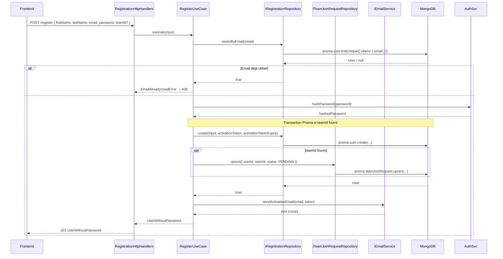
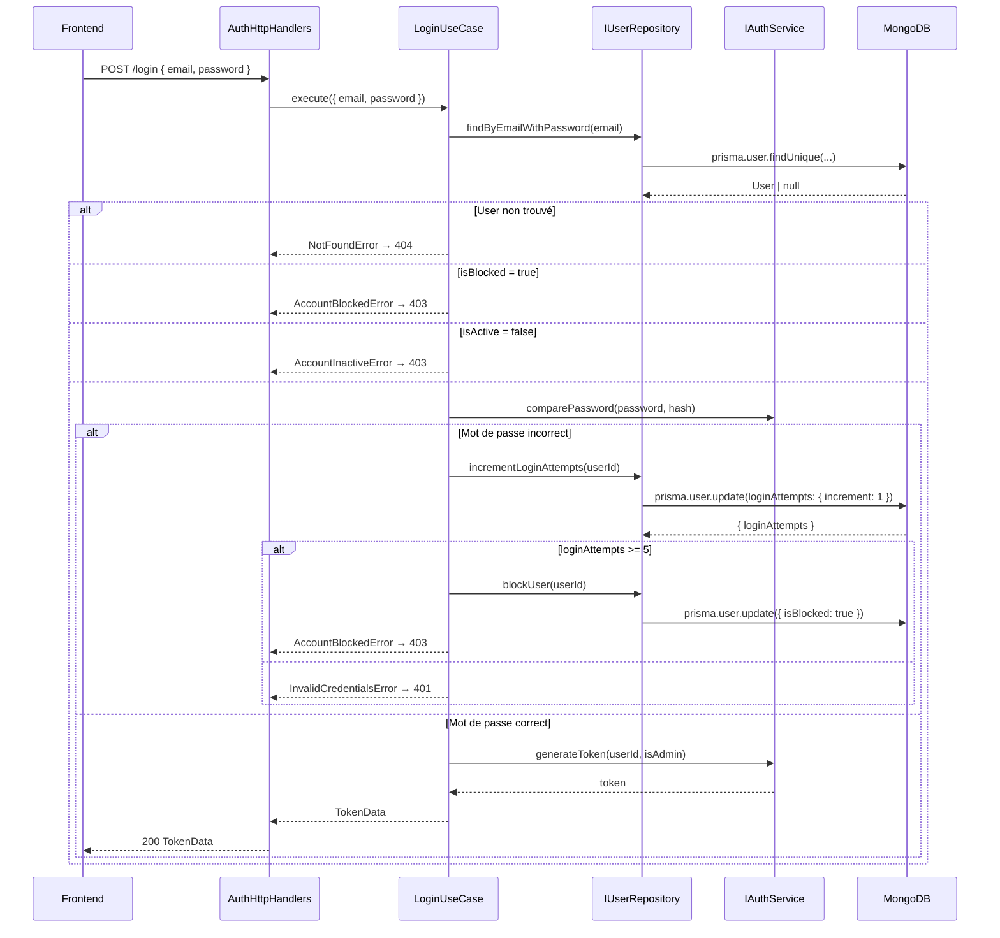
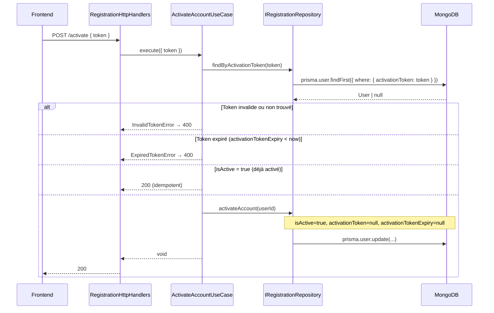
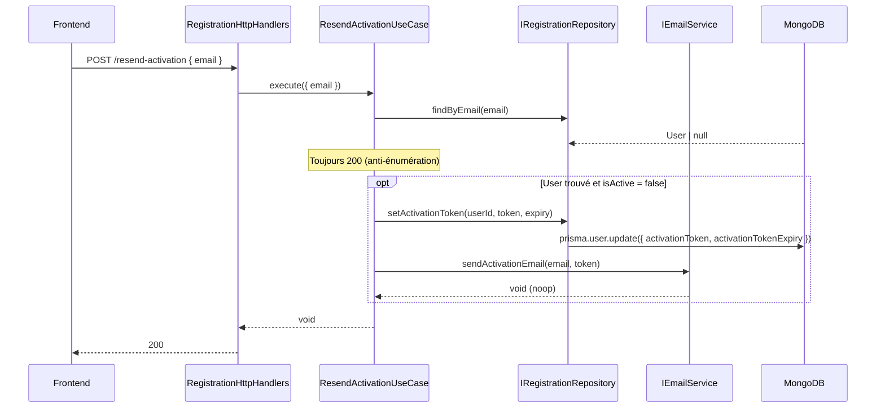
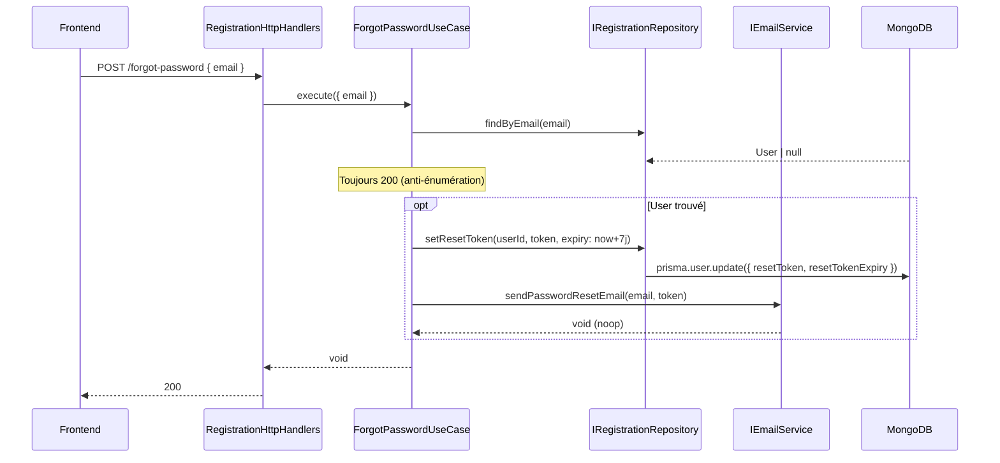
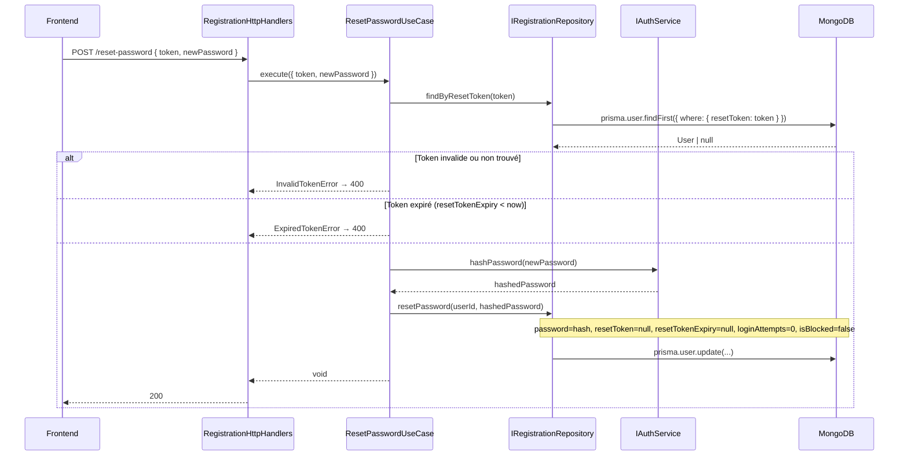
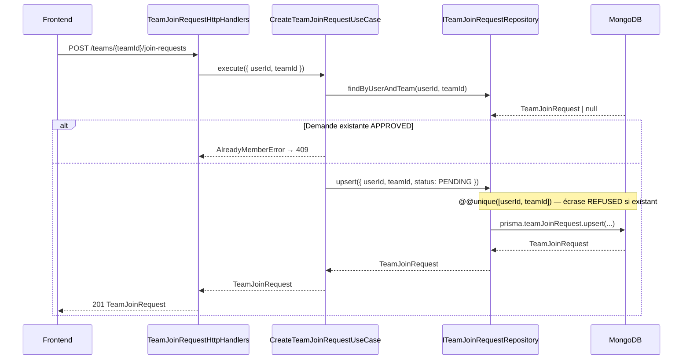
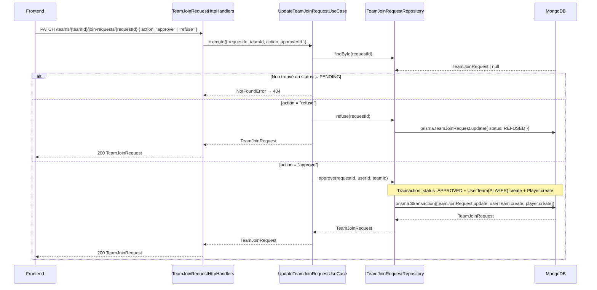
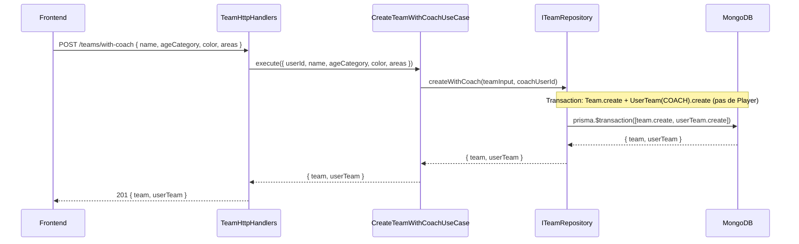

# Inscription et authentification

## Définition

L'authentification couvre l'ensemble des flux permettant à un utilisateur de créer un compte, de s'identifier sur la plateforme, et de récupérer l'accès à son compte. L'inscription est **ouverte** : tout utilisateur peut créer un compte sans intervention préalable de l'admin. Le compte créé est **inactif** jusqu'à activation.

---

## Acteurs concernés

| Rôle | Implication |
|------|-------------|
| Utilisateur non inscrit | Peut s'inscrire via le formulaire public |
| Admin | Peut créer un compte pour quelqu'un, activer un compte, débloquer un compte |
| Utilisateur sans équipe | Accède à la plateforme en lecture seule, peut rejoindre ou créer une équipe |
| Coach | Valide les demandes d'adhésion à son équipe |

---

## Flux d'inscription

### Champs du formulaire

| Champ | Obligatoire | Remarques |
|-------|-------------|-----------|
| Prénom | ✅ | |
| Nom | ✅ | |
| Email | ✅ | Doit être unique en base |
| Mot de passe | ✅ | Voir règles ci-dessous |
| Équipe (rejoindre ou créer) | ❌ | Optionnel à l'inscription, disponible depuis le profil après |

### Règles de validation du mot de passe

- Longueur minimale : **8 caractères**
- Au moins **1 chiffre**
- Au moins **1 majuscule**
- Les caractères spéciaux sont autorisés (non obligatoires)

### Activation du compte

Un compte nouvellement créé est **inactif**. Deux chemins pour l'activer :

1. **Lien d'activation par email** — un email est envoyé à l'adresse fournie à l'inscription. Le lien active le compte en un clic.
2. **Activation manuelle par l'Admin** — depuis le panel utilisateurs, l'admin peut activer un compte sans passer par l'email.

**Contenu de l'email d'activation :**

- Un lien d'activation unique
- Pas d'autres informations pour l'instant (i18n et contenu enrichi spécifiés dans une phase ultérieure)

> L'implémentation de l'envoi d'email est différée (Phase ultérieure). La règle métier est posée dès maintenant.

---

## Flux de connexion

L'utilisateur saisit son **email** et son **mot de passe**.

### Cas : compte inactif

Un message d'erreur s'affiche :

> "Votre compte n'est pas encore activé. Vérifiez votre boîte email ou demandez un renvoi du lien d'activation."

Un lien / formulaire permet de **renvoyer l'email d'activation** à l'adresse enregistrée.

### Cas : mauvais mot de passe — blocage progressif

| Tentatives échouées | Comportement |
|---------------------|--------------|
| 1 à 4 | Message d'erreur générique ("email ou mot de passe incorrect") |
| 5 | Compte **bloqué** — message spécifique, connexion impossible |

Un compte bloqué ne peut être débloqué que par **l'Admin**. L'utilisateur doit contacter l'admin pour en faire la demande.

### Redirect post-connexion

Après connexion réussie, l'utilisateur est redirigé vers `/dashboard`. Le dashboard s'adapte selon le(s) rôle(s) de l'utilisateur (voir `profiles/*/overview.md`).

---

## Mot de passe oublié

1. L'utilisateur saisit son **email** sur la page de récupération.
2. Un email contenant un **lien de reset** est envoyé (si l'adresse existe en base).
3. Le lien est valide **7 jours**.
4. Le lien pointe vers un formulaire permettant de saisir un nouveau mot de passe (soumis aux mêmes règles de validation).
5. Après reset réussi, l'utilisateur est redirigé vers la page de connexion.

**Règles :**

- Le flow fonctionne pour les comptes **inactifs** (permet de récupérer l'accès avant activation).
- Le flow fonctionne pour les comptes **bloqués** — un reset réussi **débloque** automatiquement le compte.
- L'email envoyé est identique qu'une adresse soit trouvée ou non (éviter l'énumération d'emails).

---

## Première connexion — onboarding sans équipe

À la première connexion d'un utilisateur sans `UserTeam` associée, un **écran d'onboarding** est affiché (avant le dashboard).

> La condition de déclenchement est `UserTeam.count === 0`, pas l'absence de rôles. Un utilisateur assigné comme arbitre sur un match avant toute équipe voit quand même l'onboarding.

L'écran propose trois actions, **non mutuellement exclusives** :

| Action | Effet | Immédiat ? |
|--------|-------|-----------|
| Se signaler comme arbitre | `User.isReferee = true` | ✅ Immédiat |
| Rejoindre une équipe | Soumettre une `TeamJoinRequest` (PLAYER ou COACH) | ⏳ Validation requise |
| Créer une équipe | Créer l'équipe + s'assigner COACH | ✅ Immédiat |

L'utilisateur peut aussi **passer cette étape** et accéder directement au dashboard en lecture seule. Les trois actions restent disponibles depuis son profil.

---

## Rejoindre une équipe existante

Disponible : à l'onboarding et depuis la page profil.

**Flow :**

1. L'utilisateur choisit une équipe dans la liste des équipes existantes et sélectionne son **rôle souhaité** (`PLAYER` ou `COACH`).
2. Une **demande d'adhésion** est soumise avec le rôle souhaité.
3. La demande est envoyée au **coach de l'équipe** et à l'**admin**.
4. **Une seule validation suffit** — le coach est prioritaire, l'admin peut également valider.
5. En cas d'**approbation** :
   - `requestedRole = PLAYER` → création du `UserTeam(PLAYER, teamId)` + `Player`
   - `requestedRole = COACH` → création du `UserTeam(COACH, teamId)` uniquement (pas de `Player`)
6. En cas de **refus** → aucun enregistrement créé. L'utilisateur peut soumettre une nouvelle demande.

Tant que la demande est en attente, l'utilisateur reste sans équipe (lecture seule).

---

## Créer une équipe

Disponible : à l'onboarding et depuis la page profil.

**Champs du formulaire de création :**

| Champ | Obligatoire | Remarques |
|-------|-------------|-----------|
| Nom de l'équipe | ✅ | |
| Catégorie d'âge | ✅ | U9, U11, U13, U15, U18, Senior (voir `02-championship.md`) |
| Couleur de la tenue | ✅ | |
| Terrain(s) | ✅ | Un ou plusieurs terrains où l'équipe joue à domicile |

**Flow :**

1. L'utilisateur soumet le formulaire de création.
2. L'équipe est créée immédiatement et l'utilisateur devient automatiquement **Coach** (`UserTeam(COACH, teamId)`).
3. L'utilisateur est redirigé vers son dashboard avec son nouveau rôle coach actif.

---

## Matrice de permissions

| Action | Non inscrit | Sans équipe | Admin |
| ------ | ----------- | ----------- | ----- |
| S'inscrire | ✅ | — | — |
| Se connecter | ✅ | ✅ | ✅ |
| Réinitialiser son mot de passe | ✅ | ✅ | ✅ |
| Renvoyer l'email d'activation | ✅ (compte inactif) | — | — |
| Activer un compte (email) | ✅ | — | — |
| Activer un compte (panel) | ❌ | ❌ | ✅ |
| Débloquer un compte | ❌ | ❌ | ✅ |
| Se signaler comme arbitre | — | ✅ | ✅ |
| Rejoindre une équipe (PLAYER ou COACH) | — | ✅ | — |
| Créer une équipe | — | ✅ | ✅ |
| Valider une demande d'adhésion | — | ❌ | ✅ |

---

## Cas limites et contraintes

- Un email déjà utilisé ne peut pas être réutilisé pour un second compte. Message d'erreur à l'inscription (sans confirmer si l'email existe — voir sécurité).
- Un lien d'activation ou de reset expiré ou déjà utilisé affiche une page d'erreur avec option de renvoi.
- L'utilisateur ne peut pas avoir deux demandes d'adhésion en attente pour la **même** équipe simultanément.
- L'utilisateur peut avoir des demandes en attente pour plusieurs équipes différentes.
- Un compte bloqué ne peut pas se connecter même avec le bon mot de passe.

---

## Questions ouvertes

- Contenu enrichi de l'email d'activation (langue, nom de l'utilisateur, branding) à spécifier lors de la phase i18n.

---

## Spécification technique

### Diagrammes de séquence

#### Inscription



#### Connexion (blocage progressif)



#### Activation de compte (lien email)



#### Renvoi du lien d'activation



#### Mot de passe oublié



#### Reset de mot de passe



#### Demande d'adhésion à une équipe



#### Traitement d'une demande d'adhésion



#### Création d'équipe à l'onboarding



---

### Modèle de données (Prisma)

#### Modifications — `User`

```prisma
model User {
  id                    String    @id @default(auto()) @map("_id") @db.ObjectId
  lastName              String?
  firstName             String
  email                 String    @unique
  password              String
  avatar                String?
  isAdmin               Boolean   @default(false)
  isActive              Boolean   @default(false)   // nouveau
  isBlocked             Boolean   @default(false)   // nouveau
  isReferee             Boolean   @default(false)   // nouveau — auto-déclaration arbitre
  loginAttempts         Int       @default(0)       // nouveau
  activationToken       String?                     // nouveau
  activationTokenExpiry DateTime?                   // nouveau
  resetToken            String?                     // nouveau
  resetTokenExpiry      DateTime?                   // nouveau
  createdAt             DateTime  @default(now())

  players      Player[]
  userTeams    UserTeam[]
  userMatches  UserMatch[]
  joinRequests TeamJoinRequest[]  // nouveau
}
```

#### Nouveau modèle — `TeamJoinRequest`

```prisma
enum JoinRequestStatus {
  PENDING
  APPROVED
  REFUSED
}

model TeamJoinRequest {
  id            String            @id @default(auto()) @map("_id") @db.ObjectId
  userId        String            @db.ObjectId
  teamId        String            @db.ObjectId
  requestedRole TeamRole          @default(PLAYER)  // nouveau — PLAYER ou COACH
  status        JoinRequestStatus @default(PENDING)
  createdAt     DateTime          @default(now())
  updatedAt     DateTime          @updatedAt

  user User @relation(fields: [userId], references: [id], onDelete: Cascade)
  team Team @relation(fields: [teamId], references: [id], onDelete: Cascade)

  @@unique([userId, teamId])
  @@map("teamJoinRequests")
}
```

> `Team` nécessite également l'ajout du champ `joinRequests TeamJoinRequest[]` en relation inverse. Vérifier si `ageCategory` doit être ajouté au modèle `Team` (cf. `spec/04-team.md`).

---

### Contrat API

| Méthode | Route | OperationId | Auth | Description |
|---------|-------|-------------|------|-------------|
| `POST` | `/activate` | `activateAccount` | ❌ | Activation compte via token |
| `POST` | `/resend-activation` | `resendActivation` | ❌ | Renvoi lien d'activation |
| `POST` | `/reset-password` | `resetPassword` | ❌ | Reset mot de passe via token |
| `PATCH` | `/users/{userId}/activate` | `adminActivateUser` | Admin | Activation manuelle |
| `PATCH` | `/users/{userId}/unblock` | `adminUnblockUser` | Admin | Déblocage manuel |
| `POST` | `/me/referee` | `declareReferee` | JWT | Se signaler comme arbitre |
| `POST` | `/teams/{teamId}/join-requests` | `createTeamJoinRequest` | JWT | Soumettre une demande d'adhésion (PLAYER ou COACH) |
| `GET` | `/teams/{teamId}/join-requests` | `getTeamJoinRequests` | JWT (coach/admin) | Lister les demandes (filtre `?status=`) |
| `PATCH` | `/teams/{teamId}/join-requests/{requestId}` | `updateTeamJoinRequest` | JWT (coach/admin) | Approuver ou refuser |
| `POST` | `/teams/with-coach` | `createTeamWithCoach` | JWT | Créer équipe + s'assigner COACH |

**Schémas à créer**

`ActivateAccountInput`
```json
{ "token": "string" }
```

`ResendActivationInput`
```json
{ "email": "string (format: email)" }
```

`ResetPasswordInput`
```json
{ "token": "string", "newPassword": "string (minLength: 8)" }
```

`UpdateTeamJoinRequestInput`
```json
{ "action": "approve | refuse" }
```

`CreateTeamJoinRequestInput`
```json
{ "requestedRole": "PLAYER | COACH" }
```

`TeamJoinRequest` (réponse)
```json
{
  "id": "string",
  "userId": "string",
  "teamId": "string",
  "requestedRole": "PLAYER | COACH",
  "status": "PENDING | APPROVED | REFUSED",
  "createdAt": "string (date-time)",
  "updatedAt": "string (date-time)"
}
```

`CreateTeamWithCoachInput`
```json
{
  "name": "string",
  "ageCategory": "U9 | U11 | U13 | U15 | U18 | Senior",
  "color": "string",
  "areas": "[AreaWithoutId]"
}
```

**Schémas à modifier**

`UserWithoutPassword` — ajouter les champs :
```yaml
isActive:
  type: boolean
  nullable: false
isBlocked:
  type: boolean
  nullable: false
isReferee:
  type: boolean
  nullable: false
```

> Le champ `roles` dérivé inclut `REFEREE` si `isReferee = true` OU si l'utilisateur a des entrées `UserMatch`.

---

### Architecture hexagonale

#### Nouveau domaine — `registration`

```text
backend/src/registration/
├── domain/
│   ├── Registration.ts           # CreateUserInput, RegisterResult, ActivationToken
│   └── RegistrationErrors.ts    # EmailAlreadyUsedError, InvalidTokenError, ExpiredTokenError, AccountInactiveError, AccountBlockedError
├── ports/
│   ├── IRegistrationRepository.ts
│   └── IEmailService.ts
├── application/
│   ├── RegistrationUseCases.ts
│   └── RegistrationUseCases.test.ts
└── infrastructure/
    ├── PrismaRegistrationRepository.ts
    ├── NoopEmailService.ts
    └── RegistrationHttpHandlers.ts
```

**`IRegistrationRepository`**

```typescript
interface IRegistrationRepository {
  existsByEmail(email: string): Promise<boolean>
  findByEmail(email: string): Promise<User | null>
  findByActivationToken(token: string): Promise<User | null>
  findByResetToken(token: string): Promise<User | null>
  create(input: CreateUserInput, activationToken: string, activationTokenExpiry: Date): Promise<User>
  createWithJoinRequest(input: CreateUserInput, activationToken: string, activationTokenExpiry: Date, teamId: string, requestedRole: TeamRole): Promise<User>
  activateAccount(userId: string): Promise<void>
  setActivationToken(userId: string, token: string, expiry: Date): Promise<void>
  setResetToken(userId: string, token: string, expiry: Date): Promise<void>
  resetPassword(userId: string, hashedPassword: string): Promise<void>
  declareReferee(userId: string): Promise<void>
  adminActivateUser(userId: string): Promise<void>
  adminUnblockUser(userId: string): Promise<void>
}
```

**`IEmailService`**

```typescript
interface IEmailService {
  sendActivationEmail(to: string, token: string): Promise<void>
  sendPasswordResetEmail(to: string, token: string): Promise<void>
}
```

**Use cases — `RegistrationUseCases`**

| Use case | Input | Output | Description |
|----------|-------|--------|-------------|
| `register` | `RegisterInput` | `UserWithoutPassword` | Crée User inactif + TeamJoinRequest(PENDING) si teamId |
| `activateAccount` | `{ token }` | `void` | Active le compte via token email |
| `resendActivation` | `{ email }` | `void` | Nouveau token + renvoi email (toujours 200) |
| `forgotPassword` | `{ email }` | `void` | Reset token + envoi email (toujours 200) |
| `resetPassword` | `{ token, newPassword }` | `void` | Reset password, débloque, remet loginAttempts à 0 |
| `declareReferee` | `{ userId }` | `void` | Auto-déclaration arbitre — `isReferee = true` (idempotent) |
| `adminActivateUser` | `{ userId }` | `void` | Activation manuelle admin |
| `adminUnblockUser` | `{ userId }` | `void` | Déblocage manuel admin |

#### Nouveau domaine — `teamJoinRequest`

```text
backend/src/teamJoinRequest/
├── domain/
│   ├── TeamJoinRequest.ts        # TeamJoinRequest, JoinRequestStatus, CreateJoinRequestInput
│   └── TeamJoinRequestErrors.ts # JoinRequestNotFoundError, JoinRequestNotPendingError, AlreadyMemberError
├── ports/
│   └── ITeamJoinRequestRepository.ts
├── application/
│   ├── TeamJoinRequestUseCases.ts
│   └── TeamJoinRequestUseCases.test.ts
└── infrastructure/
    ├── PrismaTeamJoinRequestRepository.ts
    └── TeamJoinRequestHttpHandlers.ts
```

**`ITeamJoinRequestRepository`**

```typescript
interface ITeamJoinRequestRepository {
  findById(id: string): Promise<TeamJoinRequest | null>
  findByUserAndTeam(userId: string, teamId: string): Promise<TeamJoinRequest | null>
  findByTeam(teamId: string, status?: JoinRequestStatus): Promise<TeamJoinRequest[]>
  upsert(userId: string, teamId: string, requestedRole: TeamRole): Promise<TeamJoinRequest>
  approve(requestId: string, userId: string, teamId: string, requestedRole: TeamRole): Promise<TeamJoinRequest>
  refuse(requestId: string): Promise<TeamJoinRequest>
}
```

> `approve` encapsule la transaction Prisma selon `requestedRole` :
> - `PLAYER` → `status=APPROVED` + `userTeam.create({ role: PLAYER })` + `player.create()`
> - `COACH` → `status=APPROVED` + `userTeam.create({ role: COACH })` (pas de `Player`)

**Use cases — `TeamJoinRequestUseCases`**

| Use case | Input | Output | Description |
|----------|-------|--------|-------------|
| `createRequest` | `{ userId, teamId, requestedRole }` | `TeamJoinRequest` | Upsert demande PENDING (erreur si APPROVED existant) |
| `getTeamRequests` | `{ teamId, status? }` | `TeamJoinRequest[]` | Liste filtrée par statut |
| `updateRequest` | `{ requestId, teamId, action, approverId }` | `TeamJoinRequest` | Approuve ou refuse selon `requestedRole` (guard: PENDING uniquement) |

#### Extension domaine `team` — `createTeamWithCoach`

Nouveau use case dans `TeamUseCases`. Ajout sur `ITeamRepository` :

```typescript
interface ITeamRepository {
  // ... méthodes existantes ...
  createWithCoach(input: CreateTeamInput, coachUserId: string): Promise<{ team: Team; userTeam: UserTeam }>
}
```

#### Extension domaine `auth` — login enrichi

Deux nouvelles méthodes requises sur `IUserRepository` :

```typescript
interface IUserRepository {
  // ... méthodes existantes ...
  incrementLoginAttempts(userId: string): Promise<number>  // retourne le nouveau compteur
  blockUser(userId: string): Promise<void>
}
```

Le `LoginUseCase` existant doit vérifier dans cet ordre : `isBlocked` → `isActive` → credentials → incrémenter/bloquer.

---

### Logique métier

**Génération de tokens**

```typescript
const token = crypto.randomUUID()
const ACTIVATION_EXPIRY_HOURS = parseInt(process.env.ACTIVATION_TOKEN_EXPIRY_HOURS ?? '48')
const activationTokenExpiry = new Date(Date.now() + ACTIVATION_EXPIRY_HOURS * 3_600_000)
const resetTokenExpiry = new Date(Date.now() + 7 * 24 * 3_600_000) // 7 jours — non configurable
```

**Blocage progressif**

```
Tentative échouée :
  loginAttempts += 1
  si loginAttempts >= 5 → isBlocked = true → 403
  sinon → 401 "email ou mot de passe incorrect"

Reset loginAttempts : uniquement via resetPassword (remet loginAttempts=0 + isBlocked=false)
Connexion réussie : ne remet PAS loginAttempts à 0
```

**Upsert `TeamJoinRequest`**

```typescript
// Re-soumettre après refus = mettre à jour l'enregistrement existant
prisma.teamJoinRequest.upsert({
  where: { userId_teamId: { userId, teamId } },
  create: { userId, teamId, status: 'PENDING' },
  update: { status: 'PENDING', updatedAt: new Date() },
})
```

Le use case vérifie d'abord : si statut existant = `APPROVED` → `AlreadyMemberError` (409), pas d'upsert.

**Transaction approbation**

```typescript
// requestedRole = PLAYER
await prisma.$transaction([
  prisma.teamJoinRequest.update({ where: { id: requestId }, data: { status: 'APPROVED' } }),
  prisma.userTeam.create({ data: { userId, teamId, role: 'PLAYER' } }),
  prisma.player.create({ data: { userId, teamId } }),
])

// requestedRole = COACH
await prisma.$transaction([
  prisma.teamJoinRequest.update({ where: { id: requestId }, data: { status: 'APPROVED' } }),
  prisma.userTeam.create({ data: { userId, teamId, role: 'COACH' } }),
  // pas de player.create — un coach n'est pas automatiquement joueur
])
```

**Variable d'environnement**

| Variable | Défaut | Description |
|----------|--------|-------------|
| `ACTIVATION_TOKEN_EXPIRY_HOURS` | `48` | TTL du token d'activation en heures |

---

### Sécurité

- **Inscription** : `409 Conflict` si email déjà enregistré — erreur explicite (Option A)
- **`forgotPassword` / `resendActivation`** : toujours `200` — le client ne sait pas si l'email existe (anti-énumération)
- **`activateAccount` / `resetPassword`** : `400` générique sur token invalide ou expiré — sans distinguer les deux cas pour ne pas aider un attaquant
- **Ordre de vérification au login** : `isBlocked` → `isActive` → credentials — évite de révéler l'état du compte via les credentials
- **Tokens** : générés via `crypto.randomUUID()` (entropie 122 bits), stockés en clair, supprimés immédiatement après usage
- **Validation des payloads** : `openapi-backend` valide tous les inputs entrants — pas de validation manuelle dans les handlers
- **Routes admin** : `requireAdmin(ctx)` sur `adminActivateUser` et `adminUnblockUser`
- **Routes coach/admin** : `GET /teams/{teamId}/join-requests` et `PATCH .../join-requests/{requestId}` — vérifier que l'appelant est `COACH` de l'équipe (`IUserTeamRepository.hasRole()`) ou `isAdmin`

---

### Cas limites techniques

- **Race condition inscription** : deux registrations simultanées avec le même email → contrainte `@@unique` sur `email` (MongoDB) garantit qu'une seule réussit — l'autre lève `PrismaClientKnownRequestError` code `P2002`, à mapper en `409`
- **Resend activation sur compte déjà actif** : le use case vérifie `isActive` avant de générer un token — si actif, retourne `200` sans effet
- **Reset password sur compte bloqué** : débloque le compte (`isBlocked=false`) + remet `loginAttempts=0` en même opération — comportement voulu par la spec
- **Upsert join request sur statut APPROVED** : le use case vérifie le statut existant avant l'upsert — si `APPROVED`, lève `AlreadyMemberError` (409)
- **`POST /teams/with-coach` sans contrainte de doublons** : un utilisateur peut créer plusieurs équipes et être COACH de chacune — pas de contrainte à ajouter
