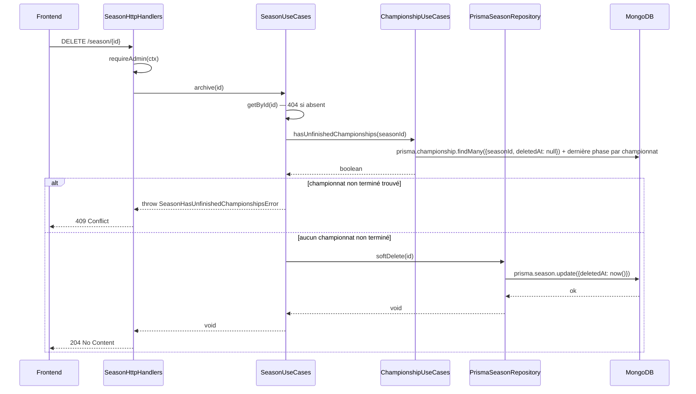

# Saison (Season)

## Définition

Une saison est une entité admin-gérée représentant une période compétitive (ex. « 2025-2026 »). Une saison peut regrouper plusieurs championnats de catégories d'âge différentes. Elle remplace le champ libre `season: string` du championnat (voir [[02-championship]]) par une référence structurée, gérable depuis Paramètres.

---

## Structure

| Attribut    | Type             | Obligatoire | Description                              |
| ----------- | ---------------- | :---------: | ---------------------------------------- |
| `id`        | ObjectId         |     ✅      | Identifiant MongoDB                      |
| `label`     | string           |     ✅      | Nom de la saison (ex. « 2025-2026 »)     |
| `startDate` | Date \| null     |     ❌      | Date de début (optionnelle, informative) |
| `endDate`   | Date \| null     |     ❌      | Date de fin (optionnelle, informative)   |
| `createdAt` | DateTime         |     ✅      | Date de création                         |
| `updatedAt` | DateTime         |     ✅      | Date de dernière modification            |
| `deletedAt` | DateTime \| null |     ✅      | Soft delete — null = active              |

---

## Contraintes métier

- Le `label` est unique et ne peut pas être vide.
- `startDate`/`endDate` sont purement informatives — aucune règle de chevauchement entre saisons, aucun calcul automatique de « saison en cours ».
- La suppression est **logique** (soft delete = archivage) : une saison archivée n'apparaît plus dans la liste des saisons proposées à la création d'un championnat, mais reste référencée par les championnats déjà créés.
- **Archivage bloqué** si un championnat lié n'est pas _terminé_ — c'est-à-dire tant que la dernière phase du championnat n'a pas atteint un classement final (voir [[05-standings]], contrainte « le classement d'une poule n'est final que lorsque tous les matchs sont `PLAYED`/`FORFEITED`/`CANCELLED` ») ou, pour une dernière phase `KNOCKOUT`, tant que le vainqueur final n'est pas déterminé. Tentative d'archivage sur une saison avec championnat non terminé → `409 Conflict`.
- Une saison liée à un championnat ne peut jamais être supprimée définitivement (hard delete), seule l'archivage est possible.

---

## Règles d'accès

- **Lecture** : tous les utilisateurs authentifiés (nécessaire pour peupler l'étape 1 du parcours de création de championnat, voir [[02-championship]]).
- **Création / Modification / Archivage** : Admin uniquement.

---

## Routes API

| Méthode  | Route            | Description                                                       |
| -------- | ---------------- | ----------------------------------------------------------------- |
| `GET`    | `/seasons`       | Liste toutes les saisons actives                                  |
| `GET`    | `/seasons/count` | Compte les saisons actives                                        |
| `GET`    | `/season/{id}`   | Récupère une saison                                               |
| `POST`   | `/season`        | Crée une nouvelle saison (Admin)                                  |
| `PATCH`  | `/season/{id}`   | Met à jour une saison existante (Admin)                           |
| `DELETE` | `/season/{id}`   | Archive une saison (Admin) — `409` si championnat lié non terminé |

---

## Interface admin

Page `/app/settings/seasons` — tuile visible uniquement si `user.isAdmin`, route protégée par `RequireRole` (voir [[21-settings-admin]]).

- Liste des saisons (label + dates + nombre de championnats liés).
- Bouton « Nouvelle saison » → Sheet avec formulaire (label + dates optionnelles).
- Icône edit par ligne → Sheet pré-remplie.
- Icône delete (archivage) par ligne → Dialog de confirmation ; erreur si championnat lié non terminé → message clair dans le dialog.
- Erreur `409` si doublon de `label` → message clair dans le formulaire.

---

## Impact sur les autres domaines

### Championnat (Championship)

- `season` (string libre) remplacé par `seasonId` (FK ObjectId, requis).
- Étape 1 du parcours de création d'un championnat (voir [[02-championship]]) consiste à choisir une saison parmi les saisons actives.
- L'API retourne l'objet `season` complet (label + dates) via relation Prisma `include`, même pattern que `ageCategory`.

---

## Migration des données existantes

Les championnats existants ont un champ `season` string (ex. « 2025-2026 »). Stratégie :

1. Extraire les valeurs distinctes de `season` sur les championnats existants.
2. Créer un enregistrement `Season` par valeur distincte (seed).
3. Script de migration : résoudre `seasonId` correspondant à chaque `season` string → écrire `seasonId` sur le championnat.
4. Supprimer le champ `season` legacy après validation.

---

## Spécification technique

Domaine `season/` — mirror exact de `ageCategory/` (voir `backend/src/ageCategory/`), même structure hexagonale, mêmes conventions de repository (`select` object, `notDeleted`).

### Diagramme de séquence



### Modèle de données (Prisma)

```prisma
model Season {
  id        String    @id @default(auto()) @map("_id") @db.ObjectId
  label     String
  startDate DateTime?
  endDate   DateTime?
  createdAt DateTime  @default(now())
  updatedAt DateTime  @updatedAt
  deletedAt DateTime?

  championships Championship[]

  @@unique([label])
  @@map("seasons")
}
```

`Championship.season: String` → `Championship.seasonId: String @db.ObjectId` + relation `season Season @relation(fields: [seasonId], references: [id])` (détail complet dans la section technique de [[02-championship]]).

### Contrat API

| Méthode  | Route            | OperationId    | Auth  | Description                                                |
| -------- | ---------------- | -------------- | ----- | ---------------------------------------------------------- |
| `GET`    | `/seasons`       | `getSeasons`   | JWT   | Liste paginée des saisons actives                          |
| `GET`    | `/seasons/count` | `countSeasons` | JWT   | Compte des saisons actives                                 |
| `GET`    | `/season/{id}`   | `getSeason`    | JWT   | Récupère une saison — 404 si absente                       |
| `POST`   | `/season`        | `createSeason` | Admin | Crée une saison — 409 si `label` dupliqué                  |
| `PATCH`  | `/season/{id}`   | `updateSeason` | Admin | Met à jour une saison — 404 si absente                     |
| `DELETE` | `/season/{id}`   | `removeSeason` | Admin | Archive (soft-delete) — 409 si championnat lié non terminé |

**Payload — `createSeason` (`SeasonInput`)**

```json
{
  "label": "2025-2026",
  "startDate": "2025-09-01T00:00:00.000Z",
  "endDate": "2026-06-30T00:00:00.000Z"
}
```

`startDate`/`endDate` : `nullable: true`, non requis.

**Réponse — 201 (`Season`)**

```json
{
  "id": "...",
  "label": "2025-2026",
  "startDate": "2025-09-01T00:00:00.000Z",
  "endDate": "2026-06-30T00:00:00.000Z",
  "createdAt": "...",
  "updatedAt": "..."
}
```

### Architecture hexagonale

#### Types domaine (`src/season/domain/Season.ts`)

```typescript
export type Season = {
  id: string;
  label: string;
  startDate: Date | null;
  endDate: Date | null;
  createdAt: Date;
  updatedAt: Date;
};

export type CreateSeasonInput = Omit<Season, "id" | "createdAt" | "updatedAt">;
export type UpdateSeasonInput = Partial<CreateSeasonInput>;
```

#### Port (`src/season/ports/ISeasonRepository.ts`)

```typescript
export interface ISeasonRepository {
  count(): Promise<number>;
  findAll(options: PaginationOptions): Promise<Season[]>;
  findById(id: string): Promise<Season | null>;
  create(input: CreateSeasonInput): Promise<Season>;
  update(id: string, input: UpdateSeasonInput): Promise<Season>;
  softDelete(id: string): Promise<void>;
}
```

#### Use cases (`src/season/application/SeasonUseCases.ts`)

| Use case  | Input                     | Output     | Description                                                                                                                             |
| --------- | ------------------------- | ---------- | --------------------------------------------------------------------------------------------------------------------------------------- |
| `getAll`  | `PaginationOptions`       | `Season[]` | Liste                                                                                                                                   |
| `getById` | `id`                      | `Season`   | 404 via `SeasonNotFoundError` si absent                                                                                                 |
| `create`  | `CreateSeasonInput`       | `Season`   | 409 via `SeasonDuplicateLabelError` si `label` dupliqué                                                                                 |
| `update`  | `id`, `UpdateSeasonInput` | `Season`   | 404 si absent                                                                                                                           |
| `archive` | `id`                      | `void`     | Vérifie `ChampionshipUseCases.hasUnfinishedChampionships(id)` avant soft-delete — 409 via `SeasonHasUnfinishedChampionshipsError` sinon |

> `archive` injecte `ChampionshipUseCases` (ou une méthode dédiée du port championship) — dépendance inter-domaine assumée, même pattern que `AgeCategory` protégé par intégrité référentielle Team/Championship (voir [[19-age-category]]).

#### Handler HTTP (`src/season/infrastructure/SeasonHttpHandlers.ts`)

Mapping direct des `operationId` → `SeasonUseCases`, `requireAdmin(ctx)` sur `create`/`update`/`archive` uniquement. Try/catch spécifique sur `SeasonNotFoundError` (404), `SeasonDuplicateLabelError` (409), `SeasonHasUnfinishedChampionshipsError` (409) — pattern identique à `AgeCategoryHttpHandlers`.

### Logique métier

**Détection "championnat terminé"** (réutilisée par `archive`) :

```text
isChampionshipFinished(championshipId):
  lastPhase = phases.findLastByOrder(championshipId)
  if lastPhase.type == GROUP:
    return all matches of all groups of lastPhase are in {PLAYED, FORFEITED, CANCELLED}
  if lastPhase.type == KNOCKOUT:
    return final match of the bracket has a determined winner (status PLAYED or FORFEITED)
```

Cette fonction vit dans `championship/application/` (dépend de `phase`, `group`, `bracket`) et est réutilisée à la fois par `SeasonUseCases.archive` et par le verrouillage de phase (voir [[02-championship]]).

### Sécurité

- **Autorisation** : lecture ouverte à tout JWT valide (peuple le select étape 1 du wizard championnat). Écriture (`create`/`update`/`archive`) exclusivement `requireAdmin` — même garde que `AgeCategory`.
- **Validation** : `label` non vide, unicité vérifiée en base (`@@unique`), erreur Prisma `P2002` mappée en `409` par le handler.
- **Autres** : aucun point spécifique — pas de donnée sensible, pas de rate limiting dédié (aligné sur le reste de l'API).

### Cas limites techniques

- Deux requêtes `POST /season` concurrentes avec le même `label` : la contrainte `@@unique` Prisma tranche, la seconde requête reçoit `P2002` → `409`.
- `archive` doit lire l'état de **tous** les championnats liés (y compris ceux avec plusieurs phases) avant de conclure — requête `findMany` + résolution de la dernière phase par championnat, pas de raccourci sur un seul document.
