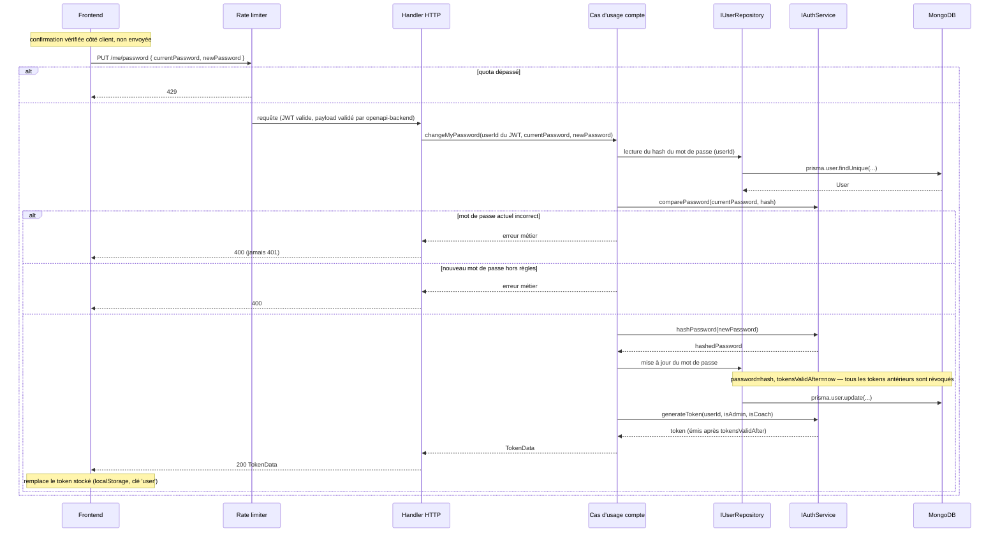
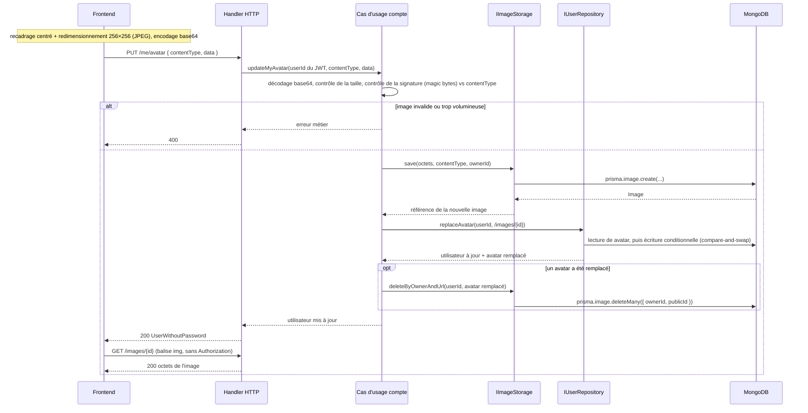

# Page compte

## Définition

La page compte permet à tout utilisateur connecté de gérer lui-même les informations de son compte : son **prénom**, son **nom**, sa **photo** et son **mot de passe**. Elle remplace l'écran `/app/my-profile`, jusqu'ici en lecture seule, par une page éditable accessible depuis le pied du menu latéral, quel que soit le profil.

L'utilisateur n'agit que sur **son propre compte**. La modification du compte d'un autre utilisateur reste une action d'Admin, inchangée (`PATCH /user/{id}`, voir [[06-user-profiles]]).

---

## Acteurs concernés

| Rôle        | Implication                                                          |
| ----------- | -------------------------------------------------------------------- |
| Admin       | Modifie son propre prénom, nom, photo et mot de passe depuis la page |
| Coach       | Idem                                                                 |
| Arbitre     | Idem                                                                 |
| Joueur      | Idem                                                                 |
| Sans équipe | Idem                                                                 |

> Aucune différence de comportement entre les rôles : la page et ses règles sont identiques pour tous.

---

## Parcours utilisateur

La page est atteinte par l'entrée de profil du pied du menu latéral (route `/app/my-profile`). Elle se compose de trois sections indépendantes : chacune s'enregistre séparément, une erreur dans l'une n'affecte pas les autres.

### Section « Photo »

1. La photo actuelle est affichée ; à défaut, les initiales de l'utilisateur, comme dans le menu latéral.
2. L'utilisateur choisit un fichier image sur son appareil (JPEG, PNG ou WebP).
3. L'image est recadrée au centre (carré) et redimensionnée à **256 × 256 px** dans le navigateur, puis envoyée.
4. La nouvelle photo remplace la précédente, sur la page et dans le menu latéral.
5. L'utilisateur peut **supprimer** sa photo : les initiales sont de nouveau affichées.

### Section « Profil »

1. Le formulaire est pré-rempli avec le prénom et le nom actuels.
2. L'**email** est affiché en lecture seule (voir « Email non modifiable »).
3. L'utilisateur modifie son prénom et/ou son nom, puis enregistre.
4. Les nouvelles valeurs sont reprises partout où l'identité de l'utilisateur est affichée (menu latéral compris).

### Section « Mot de passe »

1. L'utilisateur saisit son **mot de passe actuel**, le **nouveau mot de passe** et sa **confirmation**.
2. À la validation, le mot de passe est changé et l'utilisateur **reste connecté** sur l'appareil courant.
3. Toutes ses autres sessions (autres appareils, autres navigateurs) sont déconnectées.

---

## Règles métier

### Champs modifiables

| Champ                   | Modifiable | Obligatoire | Remarques                                                                      |
| ----------------------- | :--------: | :---------: | ------------------------------------------------------------------------------ |
| Prénom                  |     ✅     |     ✅      | Ne peut pas être vide                                                          |
| Nom                     |     ✅     |     ❌      | Vider le champ **efface** le nom                                               |
| Photo                   |     ✅     |     ❌      | Ajout, remplacement, suppression                                               |
| Mot de passe            |     ✅     |      —      | Changement soumis à la saisie du mot de passe actuel                           |
| Email                   |     ❌     |      —      | Affiché en lecture seule                                                       |
| Rôles et état du compte |     ❌     |      —      | `isAdmin`, `isReferee`, `isActive`, `isBlocked` : hors de portée de cette page |

### Email non modifiable

L'email est l'**identifiant de connexion**. Tant qu'aucun service d'email ne permet de vérifier une nouvelle adresse (voir [[10-inscription-et-authentification]], `NoopEmailService`), l'utilisateur ne peut pas le changer lui-même. Il est affiché à titre d'information.

### Compte personnel uniquement

Les actions de la page s'appliquent toujours au compte de l'utilisateur connecté, identifié par sa session. Aucun identifiant d'utilisateur n'est transmis : il est impossible de viser le compte de quelqu'un d'autre par ce biais.

Ces actions ne permettent pas de modifier les rôles ni l'état du compte (`isAdmin`, `isReferee`, `isActive`, `isBlocked`).

### Changement de mot de passe

- Le **mot de passe actuel est obligatoire** : il prouve que la personne devant l'écran est bien le titulaire du compte, et non quelqu'un profitant d'une session restée ouverte.
- Le nouveau mot de passe obéit aux **mêmes règles qu'à l'inscription** (voir [[10-inscription-et-authentification]], « Règles de validation du mot de passe ») : 8 caractères minimum, au moins 1 chiffre, au moins 1 majuscule.
- La **confirmation** doit être identique au nouveau mot de passe. Elle est vérifiée par l'interface uniquement ; elle n'est pas transmise à l'API.
- Après un changement réussi, **toutes les sessions ouvertes avant le changement sont révoquées** (même mécanisme que la réinitialisation de mot de passe). La session courante est prolongée par un nouveau jeton, délivré dans la réponse : l'utilisateur n'a pas à se reconnecter.
- Le nombre de tentatives est **limité** (voir « Sécurité › Limitation de débit »).
- Un mot de passe actuel erroné compte comme un **échec de connexion**. Au 5ᵉ échec consécutif, le compte est **bloqué temporairement** et **toutes ses sessions sont déconnectées** (voir « Sécurité › Blocage après échecs »).

### Photo

- Formats acceptés : **JPEG, PNG, WebP**.
- La photo est recadrée et redimensionnée à 256 × 256 px **avant l'envoi**. Le serveur applique en plus une **taille maximale de 100 ko**, mesurée sur l'image elle-même (octets décodés).
- Le serveur vérifie que le contenu du fichier correspond réellement au format annoncé.
- Un utilisateur a **au plus une photo**. En envoyer une nouvelle supprime la précédente.
- Supprimer sa photo est possible à tout moment.
- La suppression d'un compte utilisateur supprime sa photo : aucune image orpheline n'est conservée.
- Les photos de profil sont **consultables sans authentification** par qui en connaît l'adresse (voir « Sécurité › Route d'image publique »).

### Stockage des photos — solution temporaire

Les photos sont enregistrées, **pour l'instant**, dans la base MongoDB de l'application (collection dédiée `images`). Ce choix est explicitement **provisoire** : un système dédié à la gestion de fichiers (S3, ou un autre magasin optimisé pour les fichiers) le remplacera.

Décision d'architecture associée : le stockage est isolé derrière un port (`IImageStorage`). Changer de système de stockage revient à remplacer un adaptateur ; **le contrat d'API et l'interface ne doivent pas changer** (voir « Spécification technique › Architecture hexagonale »).

---

## Matrice de permissions

| Action                                                    | Admin | Coach | Arbitre | Joueur | Sans équipe |
| --------------------------------------------------------- | ----- | ----- | ------- | ------ | ----------- |
| Accéder à la page compte                                  | ✅    | ✅    | ✅      | ✅     | ✅          |
| Modifier son prénom et son nom                            | ✅    | ✅    | ✅      | ✅     | ✅          |
| Ajouter, remplacer ou supprimer sa photo                  | ✅    | ✅    | ✅      | ✅     | ✅          |
| Changer son mot de passe                                  | ✅    | ✅    | ✅      | ✅     | ✅          |
| Modifier son email                                        | ❌    | ❌    | ❌      | ❌     | ❌          |
| Modifier ses rôles ou l'état de son compte depuis la page | ❌    | ❌    | ❌      | ❌     | ❌          |
| Modifier le compte d'un autre utilisateur                 | ✅¹   | ❌    | ❌      | ❌     | ❌          |

¹ Hors page compte : via la gestion des utilisateurs (`PATCH /user/{id}` pour l'identité et le rôle admin, `DELETE /user/{id}/avatar` pour retirer une photo) — voir [[06-user-profiles]].

---

## Cas limites et messages d'erreur

| Situation                                                       | Comportement attendu                                                                           |
| --------------------------------------------------------------- | ---------------------------------------------------------------------------------------------- |
| Prénom vidé                                                     | Enregistrement refusé, erreur sur le champ                                                     |
| Nom vidé                                                        | Accepté : le nom est effacé                                                                    |
| Mot de passe actuel incorrect                                   | Changement refusé, message d'erreur sur le formulaire ; l'utilisateur **reste connecté**       |
| 5ᵉ mot de passe actuel incorrect consécutif                     | Compte bloqué temporairement, toutes les sessions déconnectées : retour à la page de connexion |
| Nouveau mot de passe ne respectant pas les règles               | Changement refusé, erreur sur le champ                                                         |
| Confirmation différente du nouveau mot de passe                 | Erreur sur le champ de confirmation, aucune requête envoyée                                    |
| Trop de tentatives de changement de mot de passe                | Changement refusé, message invitant à réessayer plus tard                                      |
| Fichier qui n'est pas une image JPEG, PNG ou WebP               | Envoi refusé, message d'erreur                                                                 |
| Fichier dont le contenu ne correspond pas au format annoncé     | Envoi refusé, message d'erreur ; la photo précédente est conservée                             |
| Image dépassant la taille maximale                              | Envoi refusé, message d'erreur ; la photo précédente est conservée                             |
| Suppression de la photo alors qu'il n'y en a pas                | Sans effet                                                                                     |
| Deux envois de photo simultanés (deux onglets, renvoi réseau)   | Les deux réussissent ; l'une des deux photos est conservée et affichée, l'autre est supprimée  |
| Envoi et suppression de photo simultanés                        | Les deux réussissent ; le profil affiche la nouvelle photo ou aucune, jamais une photo absente |
| Session expirée ou révoquée pendant l'utilisation de la page    | Redirection vers la page de connexion (comportement commun à toute l'application)              |
| Autre appareil connecté au moment du changement de mot de passe | Sa session est révoquée : il est renvoyé vers la page de connexion à sa prochaine action       |

> Tous les messages passent par l'i18n (`react-intl`) — aucun texte en dur.

---

## Hors périmètre

Les points suivants ne sont **pas couverts** par cette spécification :

- **Changement d'email** par l'utilisateur.
- **Suppression de son propre compte** par l'utilisateur.
- **Authentification à deux facteurs** (2FA).

---

## Évolutions futures

- **Stockage externe des photos** : remplacer le stockage MongoDB par un système dédié aux fichiers (S3 ou équivalent) en substituant l'adaptateur du port `IImageStorage`. `User.avatar` contiendra alors une URL absolue ; le contrat d'API reste identique.
- **Autres champs de profil** : l'issue d'origine laissait la liste ouverte (« à définir ») ; elle a été arrêtée à prénom et nom. Tout nouveau champ fera l'objet d'une mise à jour de cette spec.

---

## Spécification technique

### Diagrammes de séquence

#### Changement de mot de passe



#### Envoi d'une photo



L'ordre est volontaire : **nouvelle image, puis `User.avatar`, puis suppression de l'image remplacée**. Il n'y a pas de transaction. Une panne en cours de route laisse au pire une image orpheline, jamais un profil qui pointe vers une image absente.

#### Requêtes simultanées du même utilisateur

Deux onglets, deux appareils ou un renvoi réseau peuvent faire exécuter en même temps plusieurs `PUT /me/avatar` et `DELETE /me/avatar` pour le même utilisateur. Règle : **quel que soit l'entrelacement, `User.avatar` désigne une image existante ou vaut `null`**.

- `IUserRepository.replaceAvatar(userId, avatar)` remplace `User.avatar` de façon **atomique** et retourne la valeur remplacée. L'adaptateur Prisma procède par _compare-and-swap_ : il lit `avatar`, puis n'écrit que si la valeur n'a pas changé entre-temps (`updateMany` filtré sur la valeur lue), et recommence sinon. Une valeur donnée n'est donc retournée comme « remplacée » qu'à **une seule** requête.
- Chaque requête supprime **uniquement l'image qu'elle a remplacée** (`IImageStorage.deleteByOwnerAndUrl`). Une image n'est donc supprimée qu'après que le profil a cessé de la désigner, et par la seule requête qui l'a retirée ; comme chaque envoi crée une nouvelle URL, une image retirée n'est jamais désignée à nouveau.
- `removeMyAvatar` suit la même règle : remplacement par `null`, puis suppression de l'image remplacée.

Deux approches sont écartées, parce qu'elles peuvent supprimer l'image que le profil désigne :

- supprimer « toutes les images du propriétaire sauf la mienne » : la requête qui écrit `User.avatar` en premier supprime ensuite l'image de celle qui l'a écrit en dernier ;
- relire `User.avatar` puis supprimer « toutes les images sauf celle-là » : une autre requête peut enregistrer son image et la poser sur le profil entre la relecture et la suppression.

Conséquence assumée : il n'y a plus de balayage des images du propriétaire à chaque envoi. Une image orpheline (panne entre deux étapes) n'est supprimée qu'avec le compte.

---

### Modèle de données (Prisma)

#### Nouveau modèle — `Image`

```prisma
model Image {
  id          String   @id @default(auto()) @map("_id") @db.ObjectId
  publicId    String   @unique
  data        Bytes
  contentType String
  size        Int
  ownerId     String   @db.ObjectId
  createdAt   DateTime @default(now())

  @@index([ownerId])
  @@map("images")
}
```

- `publicId` : identifiant **aléatoire** de 128 bits (base64url, 22 caractères), seul identifiant exposé dans l'URL (`/images/{publicId}`). L'`id` MongoDB n'est jamais exposé (voir « Sécurité › Route d'image publique »).
- `data` : octets de l'image ; `size` : leur nombre ; `contentType` : type MIME servi tel quel par `GET /images/{id}`.
- `ownerId` : identifiant de l'utilisateur propriétaire. **Aucune relation Prisma vers `User`**, volontairement : le nettoyage (remplacement, suppression de la photo, suppression du compte) passe par le port `IImageStorage`, pour que le modèle puisse disparaître le jour où le stockage devient externe.
- Pas de `deletedAt` : une image est supprimée définitivement.

#### `User` — inchangé

`User.avatar` (`String?`) garde son type et contient l'**URL** de la photo :

| Stockage                | Valeur de `User.avatar`               |
| ----------------------- | ------------------------------------- |
| Aujourd'hui (MongoDB)   | URL relative à l'API : `/images/{id}` |
| Futur (magasin externe) | URL absolue                           |
| Pas de photo            | `null`                                |

Le frontend résout une URL relative par rapport à l'URL de base de l'API ; une URL absolue est utilisée telle quelle.

`User.tokensValidAfter` (existant, voir [[10-inscription-et-authentification]]) est désormais posé aussi par le changement de mot de passe.

---

### Contrat API

| Méthode  | Route          | OperationId        | Auth      | Requête                | Réponses                                                  |
| -------- | -------------- | ------------------ | --------- | ---------------------- | --------------------------------------------------------- |
| `PATCH`  | `/me`          | `updateMyProfile`  | JWT       | `UpdateMyProfileInput` | `200` `UserWithoutPassword` · `400` · `401`               |
| `PUT`    | `/me/avatar`   | `updateMyAvatar`   | JWT       | `UploadAvatarInput`    | `200` `UserWithoutPassword` · `400` · `401`               |
| `DELETE` | `/me/avatar`   | `removeMyAvatar`   | JWT       | —                      | `200` `UserWithoutPassword` · `401`                       |
| `PUT`    | `/me/password` | `changeMyPassword` | JWT       | `ChangePasswordInput`  | `200` `TokenData` · `400` · `401` · `429`                 |
| `GET`    | `/images/{id}` | `getImage`         | ❌ public | —                      | `200` `image/jpeg` \| `image/png` \| `image/webp` · `404` |

Les quatre routes `/me…` portent le tag `Authentication` ; `GET /images/{id}` porte le tag `Images` et `security: []`. Les erreurs renvoient un `ErrorOutput`. Un payload non conforme au schéma est rejeté par `openapi-backend` (`400`) avant d'atteindre le handler.

**Payload — `updateMyProfile` (`UpdateMyProfileInput`)**

```json
{
  "firstName": "Camille",
  "lastName": null
}
```

- `additionalProperties: false` : tout autre champ (`email`, `isAdmin`, `avatar`…) fait échouer la validation.
- Aucun champ requis : seuls les champs présents sont modifiés.
- `firstName` : `string`, `minLength: 1`, `pattern: '\S'` (au moins un caractère non blanc), non nullable.
- `lastName` : `string`, `minLength: 1`, `pattern: '\S'`, `nullable: true` — `null` efface le nom ; une chaîne vide ou blanche est refusée (`400`).
- `400` : payload non conforme au schéma (champ inconnu, prénom vide ou blanc, nom vide ou blanc).

**Payload — `updateMyAvatar` (`UploadAvatarInput`)**

```json
{
  "contentType": "image/jpeg",
  "data": "/9j/4AAQSkZJRgABAQ..."
}
```

- `additionalProperties: false` ; `contentType` et `data` requis.
- `contentType` : enum `image/jpeg` | `image/png` | `image/webp`.
- `data` : octets de l'image encodés en **base64**, sans préfixe `data:` ; `minLength: 1`.
- `400` : le contenu n'est pas une image JPEG, PNG ou WebP, ou dépasse la taille maximale.
- La photo précédente, s'il y en a une, est supprimée. Le champ `avatar` de l'utilisateur retourné contient l'URL de la nouvelle.

**Payload — `changeMyPassword` (`ChangePasswordInput`)**

```json
{
  "currentPassword": "AncienMotDePasse1",
  "newPassword": "NouveauMotDePasse2"
}
```

- `additionalProperties: false` ; les deux champs sont requis (la confirmation n'en fait pas partie).
- `currentPassword` : `string`, `minLength: 1`. `newPassword` : `string`, `minLength: 8`.
- `400` : mot de passe actuel incorrect, ou nouveau mot de passe hors règles.
- `429` : limite de débit atteinte.

Le schéma OpenAPI ne porte que `minLength: 8`. Les règles « au moins 1 chiffre » et « au moins 1 majuscule » sont vérifiées par le cas d'usage, via `isPasswordValid` (`backend/src/auth/domain/PasswordPolicy.ts`). Le mot de passe actuel est contrôlé **avant** les règles du nouveau.

**Réponse — `changeMyPassword` 200 (`TokenData`)**

```json
{
  "userId": "...",
  "email": "camille@example.com",
  "isAdmin": false,
  "token": "<nouveau JWT>"
}
```

Même schéma que la réponse de `POST /login`. Le token ayant servi à la requête est révoqué par l'opération elle-même : le client doit le remplacer par celui de la réponse.

**Réponse — `getImage` 200**

Corps binaire, `Content-Type` égal au `contentType` enregistré. Réponse cacheable : l'identifiant d'une image est immuable (un nouvel envoi crée un nouvel identifiant, donc une nouvelle URL).

| En-tête                        | Valeur                                |
| ------------------------------ | ------------------------------------- |
| `Cache-Control`                | `public, max-age=31536000, immutable` |
| `X-Content-Type-Options`       | `nosniff`                             |
| `Cross-Origin-Resource-Policy` | `cross-origin`                        |

`Cross-Origin-Resource-Policy: cross-origin` remplace la valeur par défaut de helmet (`same-origin`), qui ferait bloquer par le navigateur une balise `` chargée depuis l'origine du frontend. Un identifiant mal formé répond `404`, comme un identifiant inconnu.

---

### Architecture hexagonale

#### Nouveau domaine — `image`

```text
backend/src/image/
├── domain/
│   ├── Image.ts              # Types (ImageContentType, SaveImageInput, SavedImage, ImageContent)
│   ├── ImageErrors.ts        # ImageNotFoundError
│   └── imageSignature.ts     # Contrôle des magic bytes (JPEG, PNG, WebP)
├── ports/
│   └── IImageStorage.ts
├── application/
│   └── ImageUseCases.ts      # getById (+ tests unitaires)
└── infrastructure/
    ├── PrismaImageStorage.ts # Adaptateur actuel (collection `images`)
    └── ImageHttpHandlers.ts  # getImage
```

**Port — `IImageStorage`**

| Méthode               | Rôle                                                                                        |
| --------------------- | ------------------------------------------------------------------------------------------- |
| `save`                | Enregistre les octets d'une image avec son type et son propriétaire ; retourne sa référence |
| `findById`            | Retourne l'image (octets + `contentType`) ou rien si elle n'existe pas                      |
| `delete`              | Supprime une image                                                                          |
| `deleteByOwner`       | Supprime toutes les images d'un propriétaire                                                |
| `deleteByOwnerAndUrl` | Supprime l'image désignée par une URL, si elle appartient au propriétaire donné             |

```typescript
export interface IImageStorage {
  save(input: SaveImageInput): Promise<SavedImage> // { id, url }
  findById(id: string): Promise<ImageContent | null> // { data, contentType }
  delete(id: string): Promise<void>
  deleteByOwner(ownerId: string): Promise<void>
  deleteByOwnerAndUrl(ownerId: string, url: string): Promise<void>
}
```

`deleteByOwner` sert à la suppression d'un compte. `deleteByOwnerAndUrl` sert au remplacement et à la suppression de la photo (voir « Requêtes simultanées du même utilisateur »). Dans les deux cas le nettoyage reste borné **par propriétaire** : `User.avatar` peut contenir une valeur que ce stockage n'a pas émise (URL absolue héritée de données antérieures), et supprimer « l'image désignée par l'URL » sans vérifier son propriétaire permettrait d'effacer la photo de quelqu'un d'autre si une telle valeur désignait son image. `deleteByOwnerAndUrl` est sans effet si l'URL n'a pas été émise par le stockage ou si l'image appartient à un autre utilisateur.

Le cas d'usage de lecture servi par `getImage` appelle `findById` et répond `404` si l'image est absente.

`PrismaImageStorage` est le **seul** code qui connaît le modèle Prisma `Image`. Migrer vers S3 consiste à écrire un nouvel adaptateur du même port et à changer l'injection : ni `openapi.yml`, ni les cas d'usage, ni le frontend ne changent. Seule la forme de l'URL posée dans `User.avatar` évolue (relative → absolue), ce que le frontend gère déjà.

#### Cas d'usage self-service du compte

Les opérations `updateMyProfile`, `updateMyAvatar`, `removeMyAvatar` et `changeMyPassword` sont des cas d'usage **self-service du compte** : ils reçoivent l'identifiant de l'utilisateur **tiré du JWT** (jamais d'un paramètre de requête) et s'appuient sur les ports existants (`IUserRepository`, `IAuthService`) et sur `IImageStorage`.

Emplacement :

- `updateMyProfile`, `updateMyAvatar`, `removeMyAvatar` : domaine `user` — `ProfileUseCases` (`backend/src/user/application/ProfileUseCases.ts`) et `ProfileHttpHandlers.ts`. Ils modifient l'entité utilisateur.
- `changeMyPassword` : domaine `auth` — `AuthUseCases.changePassword` et `AuthHttpHandlers.ts`. Il émet un token, exactement comme `login`.

| Use case           | Input                                        | Output                | Description                                                                                           |
| ------------------ | -------------------------------------------- | --------------------- | ----------------------------------------------------------------------------------------------------- |
| `updateMyProfile`  | `userId`, `{ firstName?, lastName? }`        | `UserWithoutPassword` | Met à jour uniquement prénom et nom                                                                   |
| `updateMyAvatar`   | `userId`, `{ contentType, data }`            | `UserWithoutPassword` | Valide l'image, l'enregistre, pose `avatar`, supprime l'image qu'il a remplacée                       |
| `removeMyAvatar`   | `userId`                                     | `UserWithoutPassword` | Remet `avatar` à `null`, puis supprime l'image qu'il a remplacée                                      |
| `changeMyPassword` | `userId`, `{ currentPassword, newPassword }` | `TokenData`           | Vérifie le mot de passe actuel, enregistre le nouveau, pose `tokensValidAfter`, émet un nouveau token |

Les handlers ne contiennent aucune logique métier : extraction de l'utilisateur courant, appel du cas d'usage, mapping des erreurs métier vers `400`.

#### Suppression d'un utilisateur

`DELETE /user/{id}` (suppression définitive, voir [[06-user-profiles]]) supprime aussi l'image de l'utilisateur via `IImageStorage`. Il n'y a pas de cascade Prisma, puisque `Image` n'a pas de relation vers `User`.

#### Frontend

- **Page** : `MyProfile` (route `my-profile` de `AppRouting.tsx`, module `@Auth`), composée de trois sections — photo, profil, mot de passe.
- **SDK** : hooks générés par orval depuis `openapi.yml` (`useUpdateMyProfile`, `useUpdateMyAvatar`, `useRemoveMyAvatar`, `useChangeMyPassword`), exposés à l'UI par des alias stables dans la couche `infrastructure/`, et orchestrés par des hooks métier dans `application/` (structure hexagonale frontend).
- **Formulaires** : `@repo/form-factory` (voir [[15-form-factory]]) avec les schémas zod générés ; la confirmation du mot de passe est un champ ajouté au schéma du formulaire, retiré avant l'appel API.
- **Photo** : recadrage centré et redimensionnement 256 × 256 px, ré-encodage JPEG et encodage base64 dans le navigateur avant l'appel à `updateMyAvatar`.
- **URL de l'avatar** : une valeur relative (`/images/{id}`) est préfixée par l'URL de base de l'API (celle de l'instance axios) ; une valeur absolue est utilisée telle quelle. La règle s'applique partout où l'avatar est affiché (page compte, pied du menu latéral).
- **Session** : après `changeMyPassword`, le token de la réponse remplace celui stocké dans le `localStorage` (clé `'user'`). Après une modification du profil ou de la photo, l'utilisateur courant affiché par l'application est rafraîchi.

Emplacement : tout vit dans le module `@Auth` existant (aucun nouvel alias).

| Couche            | Fichiers                                                                                                    |
| ----------------- | ----------------------------------------------------------------------------------------------------------- |
| `domain/`         | `Account.ts` (types, schémas, `getUserInitials`), `password.ts` (règles du mot de passe)                    |
| `infrastructure/` | `useAuthApi.ts` (alias des hooks orval), `resizeImage.ts` (recadrage et redimensionnement)                  |
| `application/`    | `useAuthSession.ts`, `useUpdateMyProfileAction.ts`, `useMyAvatarActions.ts`, `useChangeMyPasswordAction.ts` |
| `ui/`             | `AccountPhoto/`, `AccountProfileForm/`, `ChangePasswordForm/`, `UserAvatar/`                                |
| `pages/`          | `MyProfile.tsx`                                                                                             |

La résolution d'URL (`resolveImageUrl`) est dans `@Common/imageUrl.ts` : `/images/{id}` est une route générique, réutilisable par d'autres modules.

Après `changeMyPassword`, la mutation n'invalide **aucune** requête : l'invalidation par défaut relancerait toutes les requêtes en cours avec le token tout juste révoqué, recevrait `401`, et l'intercepteur déconnecterait l'utilisateur.

---

### Sécurité

#### Autorisation — pas d'élévation de privilèges

- Les routes `/me…` exigent un JWT valide et agissent sur l'utilisateur **du token**. Aucun `id` n'est accepté en entrée : pas de vérification d'ownership à écrire, pas d'accès possible au compte d'un tiers.
- **Liste blanche de champs** : `UpdateMyProfileInput` ne déclare que `firstName` et `lastName`, avec `additionalProperties: false`. `email`, `password`, `avatar`, `isAdmin`, `isReferee`, `isActive`, `isBlocked` sont rejetés dès la validation. Le cas d'usage ne transmet au repository que ces deux champs — la protection ne repose pas sur la seule validation du schéma.
- `User.avatar` n'est jamais fourni par le client : sa valeur est calculée par le serveur à partir de l'image enregistrée.
- La modification d'un autre utilisateur et des rôles reste sur `PATCH /user/{id}`, réservée à l'Admin. Cette route n'accepte pas `avatar` : un Admin ne peut que supprimer la photo d'un autre utilisateur (`DELETE /user/{id}/avatar`, même cas d'usage que `DELETE /me/avatar`) — voir [[06-user-profiles]].

#### Mot de passe actuel incorrect : `400`, pas `401`

L'intercepteur axios du frontend traite **tout** `401` comme une session expirée : il vide le stockage local et redirige vers la page de connexion. Répondre `401` à un mot de passe actuel erroné déconnecterait l'utilisateur à la première faute de frappe. La route répond donc `400`. `401` garde son seul sens : token absent, invalide, expiré ou révoqué.

#### Révocation des sessions

Un changement réussi pose `tokensValidAfter = now` : tout JWT émis avant est refusé (`401`), exactement comme après une réinitialisation (voir [[10-inscription-et-authentification]], « Cas limites techniques › Sessions (JWT) »). Une session volée ne survit donc pas au changement de mot de passe. Le token de la requête étant lui aussi révoqué, la réponse en délivre un nouveau pour la session courante.

#### Limitation de débit

`PUT /me/password` est une surface de **devinette de mot de passe authentifiée** : quiconque dispose d'une session ouverte (poste non verrouillé, token volé) pourrait tester des mots de passe sans passer par `/login` ni par son blocage progressif. La route est donc limitée ; un dépassement répond `429`, au même format que les autres limites (voir [[10-inscription-et-authentification]], « Limitation de débit »).

| Route              | Clé | Limite par défaut | Fenêtre | Variable d'environnement |
| ------------------ | --- | ----------------- | ------- | ------------------------ |
| `PUT /me/password` | IP  | 10                | 15 min  | `LOGIN_RATE_LIMIT`       |

La route réutilise la variable de `/login` (même surface : un mot de passe est vérifié), mais avec **son propre compteur** : changer de mot de passe ne consomme pas le quota de connexion, et inversement.

#### Blocage après échecs

La limite de débit porte sur l'IP : elle ne freine pas un attaquant qui détient un token volé et change d'adresse. Un compteur **par compte** complète donc la protection.

- Un mot de passe actuel erroné incrémente `loginAttempts`, le **même compteur** que les échecs de connexion, avec le même seuil (`MAX_LOGIN_ATTEMPTS`, 5 par défaut) et la même durée de blocage (`LOGIN_LOCKOUT_MINUTES`, 15 minutes par défaut) — voir [[10-inscription-et-authentification]], « Cas : mauvais mot de passe — blocage progressif ».
- En dessous du seuil : `400`, la session reste valide.
- Au seuil : `lockedUntil` est posé **et** `tokensValidAfter = now`. La tentative répond `401` : c'est le seul cas où un mot de passe actuel erroné répond `401`, parce que la session n'existe réellement plus. Le frontend renvoie alors l'utilisateur vers la page de connexion.
- Pourquoi révoquer les sessions : `lockedUntil` n'est contrôlé qu'à la connexion. Un blocage seul laisserait vivante la session qui devine.
- Un changement de mot de passe réussi remet le compteur à zéro. Un mot de passe actuel correct accompagné d'un nouveau mot de passe hors règles ne compte pas comme un échec.
- Conséquence assumée : quiconque dispose d'une session ouverte peut bloquer le compte pendant 15 minutes. C'est préférable à lui laisser deviner le mot de passe, et sa session est coupée du même coup.

#### Validation des images

- **Type déclaré** : `contentType` restreint par enum à `image/jpeg`, `image/png`, `image/webp`.
- **Signature du fichier** : le serveur compare les premiers octets décodés (magic bytes) au type déclaré ; une incohérence répond `400`. Le `Content-Type` annoncé par le client n'est jamais cru sur parole.
- **Taille maximale** : contrôlée côté serveur, en plus du redimensionnement client (qui ne protège de rien : un client peut appeler l'API directement). Limite : **100 ko**, sur les octets décodés (`MAX_AVATAR_BYTES`). La limite de corps JSON est relevée pour `PUT /me/avatar` uniquement (`backend/config/bodyLimits.ts`), le base64 pesant un tiers de plus que l'image ; les autres routes gardent la limite par défaut. Un corps trop volumineux répond `400`, comme une image trop volumineuse.
- **Encodage** : seul le base64 standard avec remplissage est accepté ; base64url, base64 sans remplissage et URL `data:` répondent `400`.
- Le redimensionnement à 256 × 256 px est effectué par le client : ce n'est pas une garantie serveur. Les seules garanties serveur sont le type, la signature et la taille maximale.

#### Route d'image publique

`GET /images/{id}` est déclarée `security: []`. Une balise `` n'envoie pas d'en-tête `Authorization`, et le JWT vit dans le `localStorage`, pas dans un cookie : une route protégée ne pourrait pas être chargée par le navigateur.

Compromis accepté :

- Une photo de profil est une donnée **peu sensible**, déjà visible des autres utilisateurs de l'application.
- Qui connaît l'URL d'une image peut la lire, même sans compte. En revanche l'URL **ne se devine pas** : l'identifiant exposé est un jeton aléatoire de 128 bits, pas l'ObjectId MongoDB. Un ObjectId contient une date et un compteur ; à partir d'une seule URL connue, il aurait permis de parcourir les photos de tous les membres, dont des mineurs.
- Un identifiant qui n'a pas la forme attendue répond `404` sans interroger la base.
- La route ne sert que les images de la collection `images` et n'expose ni le propriétaire ni aucune autre donnée.
- La réponse est **cacheable** : l'identifiant est immuable, une nouvelle photo a une nouvelle URL.
- `X-Content-Type-Options: nosniff` est renvoyé avec l'image : le navigateur s'en tient au `Content-Type` enregistré et n'interprète jamais le contenu comme du HTML ou du script.

#### Stockage

Le mot de passe est haché par `IAuthService.hashPassword` (bcrypt), comme à l'inscription. Ni mot de passe, ni contenu d'image ne sont journalisés (règles de logs de [[10-inscription-et-authentification]]).

---

### Cas limites techniques

- **Précision de `tokensValidAfter`** : la comparaison avec le `iat` du JWT se fait à la seconde. Le token délivré par `changeMyPassword` est émis après la pose de `tokensValidAfter` et reste donc valide.
- **Requêtes concurrentes après un changement de mot de passe** : une requête partie avec l'ancien token après le changement reçoit `401` ; l'intercepteur déconnecte alors l'utilisateur. Le frontend doit remplacer le token dès la réponse `200`.
- **`removeMyAvatar` sans photo** : idempotent — `200` avec l'utilisateur inchangé.
- **Image supprimée encore en cache** : une ancienne URL peut rester servie par le cache du navigateur jusqu'à expiration ; sans conséquence, `User.avatar` pointe déjà vers la nouvelle.
- **`avatar` hérité** : un `User.avatar` contenant déjà une URL absolue (données antérieures) reste affiché tel quel par la règle de résolution d'URL.
